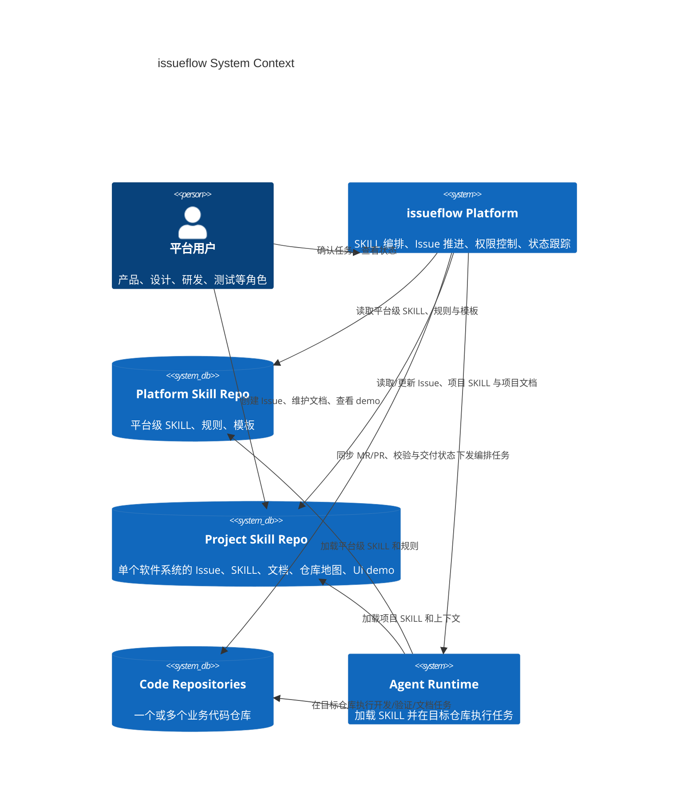

# issueflow

`issueflow` 是一个面向组织级研发协作的 Agent 编排平台，以 `Anthropic SKILLS` 为一等公民，围绕 Git 构建技能沉淀、版本管理、历史追踪与多仓库协作。

项目并未将单一代码托管平台或 CI 平台固化为永久约束。当前主要支持路径是 `GitLab + OpenCode`，其中 `GitLab CI` 是当前主执行平面。

## 项目背景

AI coding agent 已经可以显著提高研发效率，但在团队和企业场景中仍然存在明显门槛。在一些场景下，高水平个人工作流可能比平台化流程更高效。

但当组织希望把这类能力用于跨角色协作、流程治理和持续交付时，关注点就不再只是个人效率本身，还会扩展到权限边界、经验沉淀、结果审计、成本归属与流程稳定性。

`issueflow` 的目标不是否定超级个体或个人最佳实践，而是为组织场景补充一层可控、可复用、可审计的研发自动化基础设施，让优秀实践更容易沉淀并在团队内复用。

- 使用门槛高，效果高度依赖个人提示词、操作习惯和熟练度。
- 个人使用经验难以沉淀为组织可复用的资产，能力容易停留在个人层面。
- 企业统一付费后，也很难保证工具只被用于工作相关内容，缺少边界与治理能力。

## 战略定位

`issueflow` 是一个以 `Anthropic SKILLS` 为一等公民的 Agent 编排平台。它不是把 agent 当成单次代码生成器，而是把 `SKILL`、`Issue`、`Git` 和多仓库交付流程组织成一套可持续演进的系统。

### 核心理念

- **SKILL First**：`SKILL` 是平台中的核心编排单元，用来承载方法、规范、模板、约束和执行上下文，而不只是提示词附件。
- **Git Native**：Git 不只是代码仓库，也是 `SKILL` 的存储、版本管理、历史追踪和审计系统。
- **Platform + Project Skill Repo**：平台级 `<platform-skill-repo>` 管理系统级 skills 与规则；项目级 `<project-skill-repo>` 面向单个软件系统，负责该项目的 issue、skills、仓库索引、项目文档和持续演进的 demo。
- **Agent Orchestration**：平台负责任务拆分、技能匹配、状态跟踪、权限控制和结果回写，不把组织治理责任下沉给单个 agent。
- **Code Is Cheap**：代码、demo、文档和工作流都应快速迭代，持续逼近更好的产品想法和交付方式。

### 项目结构模型

平台推荐采用“一个平台级 `skill repo` + 多个项目级 `skill repo` + 多个执行仓库”的结构：

```text
┌──────────────────────────────────────────────────────────────────┐
│  <platform-skill-repo>                                           │
│  ├─ skills/                 # 平台级通用 Anthropic SKILLS       │
│  ├─ policies/               # 系统级规则、权限、编排协议        │
│  ├─ templates/              # 通用模板与脚手架                  │
│  └─ docs/                   # 平台级设计与使用文档              │
└──────────────────────────────────────────────────────────────────┘
                               │ 继承 / 复用
                               ▼
┌──────────────────────────────────────────────────────────────────┐
│  <project-skill-repo>                                            │
│  ├─ issues/                 # 单个软件系统的 issue 与上下文      │
│  ├─ skills/                 # 该项目沉淀和覆盖的 Anthropic       │
│  │                          # SKILLS                             │
│  ├─ docs/                   # 架构、SOP、仓库说明                │
│  ├─ repos/                  # 其它代码仓库在哪里、职责是什么     │
│  ├─ demos/ui/               # 持续演进的 UI demo                │
│  └─ README.md               # 项目导航与协作约定                 │
└──────────────────────────────────────────────────────────────────┘
                               │
                               │ 编排 / 同步
                               ▼
┌──────────────────────────────┐  ┌──────────────────────────────┐
│  app-repo-a                  │  │  app-repo-b                  │
│  ├─ src/                     │  │  ├─ src/                     │
│  ├─ .gitlab-ci.yml           │  │  ├─ .gitlab-ci.yml           │
│  └─ README.md                │  │  └─ README.md                │
└──────────────────────────────┘  └──────────────────────────────┘
```

### 工作流程

1. 平台先从 `<platform-skill-repo>` 提供系统级 skills、规则和模板。
2. 用户在项目级 `<project-skill-repo>` 中创建或推进单个软件系统的 Issue。
3. 平台基于系统级能力、项目上下文和项目沉淀的 `SKILL` 选择或组合执行路径。
4. Agent 加载对应 `SKILL`，在目标代码仓库或文档仓库中执行任务。
5. 代码变更、验证结果、MR/PR 状态和设计产物回写到 `<project-skill-repo>`。
6. 平台与项目通过持续更新的文档、UI demo 和 `SKILL`，把一次性交付转化为长期资产。

### 当前落地与演进

| 维度 | 说明 |
| --- | --- |
| **平台核心** | 以 `SKILL` 为中心的 Agent 编排、Issue 推进与多仓库协同 |
| **技能载体** | 优先使用 Git 管理平台级与项目级 `SKILL`、规则和历史 |
| **平台主仓** | `<platform-skill-repo>` 承载系统级 skills、规则与模板 |
| **项目主仓** | `<project-skill-repo>` 作为单个软件系统的协调层和知识主仓 |
| **当前落地** | 当前主要支持路径是 `GitLab + OpenCode`，由 `GitLab CI` 承担主要执行任务 |
| **演进方向** | 在不绑定单一平台的前提下，逐步抽象出更通用的 `SKILL` 编排协议与执行模型 |

## 核心特性

1. **Anthropic SKILLS 一等公民**：`SKILL` 是平台中的显式对象，可被组合、版本化、审查和持续演进。
2. **Git 驱动的技能管理**：通过 Git 管理 `SKILL`、SOP、模板、提示上下文和演进历史，让组织知识天然可追踪、可回滚、可审计。
3. **双层 Skill Repo**：平台级 `<platform-skill-repo>` 管通用能力，项目级 `<project-skill-repo>` 管单个软件系统的 issue、技能、仓库地图、规则和协作文档。
4. **多仓库项目管理**：平台能够围绕一个项目上下文编排多个代码仓库，聚合它们的任务状态、MR/PR 进展和交付结果。
5. **持续演进的产品资产**：项目级仓库不仅管理代码协作，还可以持续维护 UI demo、设计草图和架构文档，帮助产品设计者更直观地迭代方案。
6. **受控交付流程**：通过状态机、权限边界和工作流编排控制 `Issue -> PR/MR` 等关键阶段，而不是放任 agent 直接执行高风险动作。
7. **当前可用执行路径**：当前主要支持 `GitLab + OpenCode + GitLab CI` 组合，用于验证和推进通用化平台能力。

## 架构总览



- `平台用户`：包括产品、设计、研发、测试等角色。
- `Platform Skill Repo`：平台级知识主仓，统一承载系统级 `SKILL`、规则、模板和编排约束。
- `Project Skill Repo`：单个软件系统的知识主仓，统一承载 issue、项目 `SKILL`、规则文档、仓库地图和持续演进的 UI demo。
- `Code Repositories`：被编排的业务代码仓库，可以是单仓也可以是多仓。
- `issueflow Platform`：负责技能匹配、任务编排、状态跟踪、权限控制和结果聚合。
- `Agent Runtime`：同时加载平台级与项目级 `SKILL` 和上下文，在目标仓库中执行具体任务。

## 当前定位

- 平台核心定位：**以 `Anthropic SKILLS` 为一等公民的 Agent 编排平台**
- Git 定位：**`SKILL` 的存储、版本与历史管理系统**
- Skill Repo 模型：**`<platform-skill-repo>` 管系统级能力，`<project-skill-repo>` 管单个软件系统**
- 当前主要支持路径：`GitLab + OpenCode`
- `GitLab CI` 是当前主要执行平面
- `Robot Gateway` 使用 Rust 实现，负责受控工作流入口与状态管理
- Gateway 页面保持轻量服务端渲染
- 持久化在生产环境使用 `PostgreSQL`，默认集成测试流程使用嵌入式 `SQLite`

## 典型使用场景

### 场景 1：多仓库功能迭代

```text
1. 产品在 <project-skill-repo> 提交 Issue："重做组织设置页"
2. 平台先从 <platform-skill-repo> 读取通用 skills 与模板，再叠加该项目沉淀的 skills：product-discovery、ui-demo、frontend-implementation、backend-api
3. Agent 先更新 docs 与 demos/ui，帮助对齐方案
4. 平台再将任务分发到 frontend-repo 与 backend-repo
5. 各仓库独立提交 MR，状态回传到 <project-skill-repo>
6. 项目级仓库持续沉淀更新后的 skill、文档和 demo
```

### 场景 2：项目治理与知识沉淀

```text
1. 团队在 <project-skill-repo> 维护仓库地图，说明所有相关代码库的位置和职责
2. 设计者持续迭代 demos/ui，验证复杂交互与信息结构
3. 研发把成熟做法沉淀为 skills，供后续 agent 复用
4. 新需求进入后，平台优先复用已有 skills，而不是每次从零构造流程
```

## 仓库结构

### 本仓库 (issueflow)

`issueflow` 是平台核心代码仓库，包含：

- `src/`：Rust Gateway 应用代码
- `tests/`：Rust 集成测试
- `internal/pages/templates/`：轻量 Gateway HTML 模板
- `scripts/robot/integrations/gitlab-ci/`：GitLab CI 集成模板、任务包装脚本与使用文档

### 平台级 Skill Repo

平台推荐维护一个平台级 `skill repo` 作为系统级能力主仓，典型结构：

```text
<platform-skill-repo>/
├─ skills/                  # 平台级通用 Anthropic SKILLS
├─ policies/                # 权限、状态机、编排规则
├─ templates/               # 通用模板与脚手架
└─ docs/                    # 平台设计与使用文档
```

### 项目级 Skill Repo

单个软件系统推荐使用一个项目级 `skill repo` 作为主协调仓，典型结构：

```text
<project-skill-repo>/
├─ issues/                  # 单个软件系统的 issue 与补充上下文
├─ skills/                  # 项目级 Anthropic SKILLS
│  ├─ product-discovery/
│  │  └─ SKILL.md
│  ├─ ui-demo/
│  │  └─ SKILL.md
│  └─ implementation/
│     └─ SKILL.md
├─ docs/                    # 架构、SOP、规范、仓库地图
├─ repos/                   # 其它代码仓库的位置与说明
├─ demos/
│  └─ ui/                   # 持续维护的 UI demo
└─ README.md                # 项目入口说明
```

### 业务代码仓库

具体的业务代码仓库保持独立管理、独立发布：

```text
<app-repo>/
├─ src/
├─ .gitlab-ci.yml
└─ README.md
```

## 相关文档

- 设计说明：`docs/DESIGN.md`
- GitLab CI 集成：`scripts/robot/integrations/gitlab-ci/README.md`
