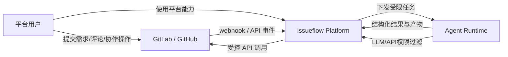

# issueflow

`issueflow` 是一个面向组织级研发协作的开发自动化项目，聚焦于从 `Issue` 到 `PR/MR` 的标准化交付流程。

项目并未将单一代码托管平台或 CI 平台固化为永久约束。当前主要支持路径是 `GitLab + OpenCode`，其中 `GitLab CI` 是当前主执行平面。

## 项目背景

AI coding agent 虽然已经可以显著提高研发效率，但在团队和企业场景中仍然存在明显门槛：

- 使用门槛高，效果高度依赖个人提示词、操作习惯和熟练度。
- 个人使用经验难以沉淀为组织可复用的资产，能力容易停留在个人层面。
- 企业统一付费后，也很难保证工具只被用于工作相关内容，缺少边界与治理能力。

`issueflow` 希望把 agent 能力从“个人助手”提升为“组织级研发基础设施”，让自动化过程更可控、可复用、可审计。

## 核心特性

1. **安全性考虑**：通过零信任边界加状态机控制，在不同工作流阶段精确限制 agent 可执行的权限和动作。
2. **自动化能力沉淀**：沉淀可复用的自动化能力，形成类似 skillclaw 的一体化 skill 中心，并通过平台级 skill 更快速地完成全角色工作，而不是依赖个人临时发挥。
3. **深度 GitLab 集成**：围绕 GitLab 事件、CI、MR、发布等环节进行深度集成，尽可能把研发流程自动化。
4. **统一环境与密钥管理**：统一管理 agent 运行环境与 API Key，用量、成本和归属更加清晰可见。
5. **统一平台授权与跨角色协作**：统一对接 GitLab/GitHub 权限，让产品、设计、研发等不同角色都能通过同一平台参与需求管理与需求设计；即使没有代码权限，也可以借助平台为产品交付赋能。
6. **强交互式 Agent 操作**：通过 AG-UI、A2UI 等交互式协议或界面，让 agent 可以更自然地与 GitLab/GitHub 进行交互式操作，而不只是执行静态脚本。
7. **办公工具对接**：可与飞书等办公工具打通，把 issue 管理、协作通知和流程推进延伸到日常办公场景。

## 架构总览

- `平台用户`：包括产品、设计、研发、测试等角色。
- `GitLab / GitHub`：承载 issue、PR/MR、评论与代码协作，并与平台双向通信。
- `issueflow Platform`：负责状态机、权限控制、流程编排、平台集成和结果回写。
- `Agent Runtime`：负责执行具体 agent 任务并返回结构化结果。

## 当前定位

- 项目当前主要支持路径是 `GitLab + OpenCode`。
- `Robot Gateway` 使用 Rust 实现。
- `GitLab CI` 是当前主要机器人执行平面。
- Gateway 页面保持轻量服务端渲染。
- 持久化在生产环境使用 `PostgreSQL`，默认集成测试流程使用嵌入式 `SQLite`。

## 仓库结构

当前目录：

- `src/`：Rust Gateway 应用代码。
- `tests/`：Rust 集成测试。
- `internal/pages/templates/`：轻量 Gateway HTML 模板。
- `scripts/robot/integrations/gitlab-ci/`：GitLab CI 集成模板、任务包装脚本与使用文档。

规划目录：

- `scripts/robot/core/`：平台无关的机器人任务入口与共享工作流逻辑。
- `runtime/opencode/`：机器人执行器使用的共享 OpenCode 运行时资产与入口。
- `web/`：规划中的 Agent Workbench 前端。

## 相关文档

- 设计说明：`docs/DESIGN.md`
- GitLab CI 集成：`scripts/robot/integrations/gitlab-ci/README.md`
