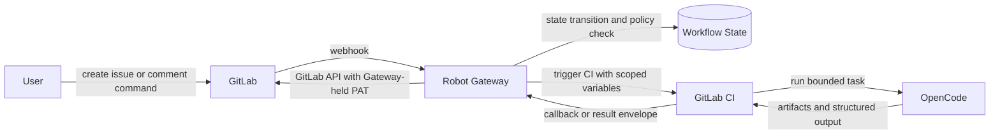

# issueflow

`issueflow` is a development automation project focused on the workflow from `Issue` to `PR/MR`.

The project does not hard-code a single code hosting platform or CI platform as a permanent constraint. The current primary supported path is `GitLab + OpenCode`, with `GitLab CI` as the main execution plane today.

## Workflow Focus

The repository is centered on making `issue -> PR/MR` delivery more structured, automatable, and observable.

The intended workflow includes stages such as:

- issue intake and validation
- explicit start of development work
- plan generation and confirmation
- implementation and verification
- PR/MR status tracking and follow-up

The exact platform integrations can evolve over time, but the workflow model is the stable core.

## Project Capabilities

`issueflow` focuses on turning `Issue -> PR/MR` delivery into a controlled workflow service instead of letting an agent hold broad repository permissions directly.

Current capability areas:

- receive GitLab webhook events and turn them into workflow state transitions
- gate development work behind explicit commands such as `/start-dev`
- trigger GitLab CI robot jobs with bounded context and correlation IDs
- run OpenCode inside CI as a constrained execution component
- keep GitLab write operations such as MR creation and release requests behind the Gateway
- apply stage-based permission policy so each issue can only use the GitLab APIs allowed for its current lifecycle stage
- keep delivery pipelines for MR, package, deploy, and release aligned with the robot workflow

## Architecture

The working model is:

- `GitLab` is the collaboration and CI entry point
- `Robot Gateway` is the control plane
- `GitLab CI` is the execution plane
- `OpenCode` is an execution component inside CI, not a trusted control-plane peer

## Zero-Trust Agent Boundary

The repository follows a zero-trust architecture for coding agents.

- `Gateway` holds the real GitLab `personal access token` or other privileged integration credentials.
- `OpenCode` does not receive the real PAT.
- `OpenCode` only receives the CI job environment and the minimum context passed into that job.
- privileged GitLab operations are mediated by `Gateway`, not executed directly by `OpenCode`.
- CI output is treated as untrusted workflow input until `Gateway` validates the stage and allowed action.

This means actions such as these should go through `Gateway`:

- create merge requests
- request or perform release actions
- write protected workflow comments or status updates
- call GitLab APIs that should be blocked before a workflow reaches the required stage

## Stage-Based Permission Control

`Gateway` should map issue lifecycle stages to allowed GitLab API operations.

Example policy shape:

- `issue-created`: allow triage and clarification only; do not allow MR creation
- `validated`: allow validation feedback and planning preparation; do not allow code contribution yet
- `start-dev-approved`: allow robot branch preparation, implementation workflow, and MR creation
- `mr-open`: allow verify, follow-up comments, and status updates
- `release-approved`: allow release preparation and publish operations

One concrete rule is especially important:

- before `/start-dev` is received and accepted, the workflow must not create or submit a merge request

This keeps repository write access tied to explicit workflow state instead of agent discretion.

Recommended stage-to-action policy:

| Workflow area | Stage | Allowed GitLab actions through Gateway | Blocked examples |
| --- | --- | --- | --- |
| Issue | `new` | read issue, write clarification comment, trigger triage | create MR, push branch, publish release |
| Issue | `triaging` | write triage feedback, request more info, trigger validate | create MR, push branch |
| Issue | `needs-info` | write clarification comment only | create MR, trigger implementation |
| Issue | `validated` | write validation summary, prepare next step | create MR, push branch |
| Issue | `awaiting-start-command` | wait for explicit `/start-dev`, write status comment | create MR, push branch |
| Issue | `mr-opened` | update issue and MR linkage, continue workflow callbacks | unrestricted release publish |
| MR | `draft-plan` | write plan draft, update MR description | push implementation branch |
| MR | `awaiting-plan-confirm` | wait for confirmation, write reminder comment | push implementation branch, verify |
| MR | `approved-for-dev` | create robot branch, update MR metadata | publish release |
| MR | `in-dev` | push robot commits, update MR, trigger verify | publish release |
| MR | `verifying` | run verify workflow, update MR checks summary | publish release |
| Release | `idle` | trigger release preparation | publish release |
| Release | `release-checking` | write release preparation summary | publish release |
| Release | `ready-for-release` | publish release, write release result | bypass Gateway and publish directly from agent |

The Gateway policy layer should evaluate these permissions before calling GitLab APIs, even if CI or an agent asks for the operation.

## Current Support Position

- Code hosting and CI integrations are not treated as hard product limits.
- The main supported combination right now is `GitLab + OpenCode`.
- `GitLab CI` is the current primary robot execution plane.
- The repository should avoid implying that other platform integrations already exist unless they are implemented.

## Repository Layout

Current directories:

- `src/`: Rust Gateway application code.
- `tests/`: Rust integration tests.
- `internal/pages/templates/`: lightweight Gateway HTML templates.
- `scripts/robot/integrations/gitlab-ci/`: GitLab CI integration template, job wrapper, and usage docs.

Planned directories:

- `scripts/robot/core/`: platform-agnostic robot task entrypoints and shared workflow logic.
- `runtime/opencode/`: shared OpenCode runtime assets and entrypoints used by robot executors.
- `web/`: planned Agent Workbench frontend.

## Current Implementation Status

- `Robot Gateway` is implemented in Rust.
- Gateway confirmation and status pages remain lightweight server-rendered pages.
- Gateway persistence targets `PostgreSQL` in production and embedded `SQLite` for default integration-test workflows.
- `Agent Workbench` is still planned rather than implemented.
- A reusable GitLab CI integration template now lives under `scripts/robot/integrations/gitlab-ci/`.

## Near-Term Direction

- Keep the Gateway foundation lightweight and reliable.
- Keep workflow logic separate from CI-platform-specific adapters.
- Expand automation around the `issue -> PR/MR` flow before broadening platform coverage.

## GitLab CI Integration

The repository includes a reusable GitLab CI integration for Docker-based robot and delivery pipelines:

- template: `scripts/robot/integrations/gitlab-ci/gitlab-ci.robot.yml`
- dispatcher: `scripts/robot/integrations/gitlab-ci/run-job.sh`
- docs: `scripts/robot/integrations/gitlab-ci/README.md`

It covers these flows:

- trigger-based robot jobs
- merge request compile and test
- default-branch package and staging deploy
- tag-based release build and publish

The integration README documents the design, required variables, and command parameters.
