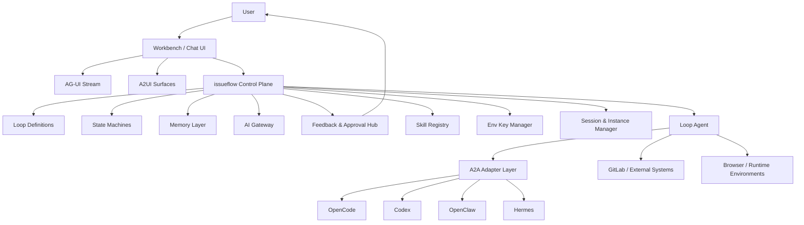

# issueflow 设计文档

## 1. 设计定位

`issueflow` 不是 `OpenCode`、`Codex`、`OpenClaw`、`Hermes` 这类通用编码 agent 产品的再实现，也不试图成为另一个“万能 AI IDE”。

`issueflow` 的定位是：

- 一个面向 **Loop Engineering** 的系统控制平面
- 一个把 **schedule + state machine + skills + memory** 组合成可长期运行 loop 的平台
- 一个把 **人类确认、预算控制、权限边界、验证与演进** 放在核心位置的 agent orchestration system

它在需要时会调用外部 agent / runtime / toolchain，例如：

- `OpenCode`
- `Codex`
- `OpenClaw`
- `Hermes`
- 未来其他兼容 A2A 或 OpenAI-compatible 的执行端

但这些外部系统在 `issueflow` 中属于 **可替换执行器**，而不是平台本体。

## 2. 核心目标

基于当前 `resources` 中关于 Loop Engineering 的资料，以及本项目已有的 AG-UI、A2UI、memory、workflow 设计，`issueflow` 的目标是：

1. 让 loop 成为平台中的一等对象，而不是脚本或临时 prompt。
2. 让 loop 通过 **对话式 schedule 定义**、**系统级/用户级状态机** 和 **skills** 来驱动。
3. 让 loop 具备跨轮次、跨天、跨会话的持久记忆，而不是只依赖上下文窗口。
4. 让系统能够自研一个轻量 loop agent 作为内核运转器，同时与外部 agent 保持即时通信。
5. 让通知、人工确认、预算、验证债务、认知退化提醒等都进入统一反馈闭环。
6. 让用户可以在 AG-UI + A2UI 界面中实时看到 agent 运行情况，并随时打断、接管、转向。
7. 让 AI 网关统一管理模型选择、token 预算、权限与执行策略。
8. 让每个用户可定义自己的人格、说话方式、长期目标、近期规则与 loop 偏好。
9. 让 system agent、session、instance、external worker 的生命周期都有明确管理。
10. 让环境密钥管理与环境技能协同工作，支持 AI 搭环境、跑浏览器验证等操作。
11. 让 skill 有注册中心、版本、适用范围、兼容性和审计轨迹。
12. 让系统自身通过 loop 产生 skill 升级建议和治理报告，形成演进机制。

## 3. 非目标

当前设计明确不做以下事情：

- 不把 `issueflow` 做成另一个通用聊天式编码工具
- 不把外部 agent 的内部实现复制进本系统
- 不默认允许无用户上下文的 GitLab 写操作
- 不允许 loop 无边界自动 merge、deploy、delete 或对外写入
- 不把 A2UI 混入 tool call 语义
- 不把 session transcript 直接当作长期工程记忆

## 4. 设计原则

本文档采用以下原则，直接继承 Loop Engineering 资料中的共识：

1. **Loop 优先于 prompt**  
   系统关注的是循环如何定义、如何停止、如何验证，而不是单条 prompt 如何写得更花。

2. **验证优先于生成**  
   generator 可以外包，evaluator 不能缺席。

3. **记忆必须落盘**  
   loop 的状态、结论、风险和待确认动作必须持久化。

4. **人始终保留否决权**  
   平台必须保留 break、pause、steering、approval 和人工接管能力。

5. **预算与权限都是一级约束**  
   token、模型、密钥、外部写权限不能散落在各 agent 内部。

6. **外部 agent 可替换，loop 核心不可漂移**  
   平台的核心是 loop 定义、状态机、记忆、反馈和治理，而不是绑定某个 vendor。

## 5. 系统总览



## 6. 核心对象模型

### 6.1 Loop Definition

Loop 是平台中的顶级配置对象。一个 loop 不是一句 prompt，而是一套长期可运行定义。

每个 `loop_definition` 至少包含：

- `id`
- `name`
- `owner_user_id`
- `scope`：system / workspace / user / project
- `persona_profile_id`
- `long_term_goal`
- `short_term_instructions`
- `schedule_policy`
- `system_state_machine_id`
- `user_state_machine_id`
- `skill_refs`
- `memory_policy`
- `budget_policy`
- `approval_policy`
- `notification_policy`
- `environment_profile_id`
- `execution_policy`
- `verification_policy`
- `evolution_policy`

### 6.2 Schedule Definition

Schedule 不是手工填 cron 的低级配置，而是 **chat-first schedule authoring**：

- 用户在对话中描述“什么时候做什么”
- 系统把自然语言 schedule 解析成规范化计划
- 规范化结果进入可审查的 `schedule_policy`
- 对高风险 loop，schedule 变更需要再次确认

支持的调度语义：

- 固定周期：例如每 30 分钟
- 时间窗：例如工作日早上 9 点到 11 点
- 事件触发：issue 更新、CI 失败、MR 评论、wiki 变更
- 条件继续：直到验证通过、直到人工确认、直到预算耗尽
- 混合调度：时间 + 事件 + 条件三者组合

### 6.3 Skill

`skill` 是 loop 的能力插件，也是组织记忆的固化载体。

skill 分为：

- `system skills`：平台级技能，例如 triage、risk review、budget review
- `project skills`：项目级知识与操作规范
- `environment skills`：与环境配置、浏览器检查、部署上下文相关
- `method skills`：如 5 Whys、PDCA、WBS、review checklist
- `verification skills`：测试、lint、UI 检查、回归验证

### 6.4 Memory

memory 不是 transcript，而是 loop 的持久化工程状态。

memory 至少分为四层：

| 层 | 作用 | 示例 |
| --- | --- | --- |
| session memory | 对话与运行事件回放 | AG-UI event log、消息、tool 结果 |
| loop memory | 单个 loop 跨轮状态 | 上次运行进度、待办、失败原因、下一步 |
| engineering memory | 对工程对象的当前理解 | issue spec、风险、验证建议、结论 |
| governance memory | 治理与反馈信号 | 验证债务、预算偏差、人工驳回、skill 改进建议 |

### 6.5 Agent Session / Agent Instance

二者必须分开：

- `agent_session`：用户可见的长期交互上下文
- `agent_instance`：一次实际运行中的执行实体

系统中有两类 agent：

1. **Loop Agent**
   - 平台内建、系统级、长期存在
   - 负责 loop 核心运转
   - 负责 schedule 触发、状态迁移、记忆读写、外部 agent 协调

2. **Worker Agents**
   - 外部或临时 agent
   - 由 Loop Agent 调度
   - 生命周期短
   - 资源受 session / instance manager 控制

## 7. Loop 定义方式

`issueflow` 使用三要素定义 loop：

1. **Schedule**
2. **State Machine**
3. **Skills**

这三者共同构成平台中的 loop DSL。

### 7.1 Schedule：决定何时触发

决定 loop 在什么时刻、因为何种事件、以何种节奏运行。

### 7.2 State Machine：决定当前允许什么

状态机分两层。

#### 系统级状态机

用于约束 loop 内核运转，建议至少包含：

- `draft`
- `ready`
- `scheduled`
- `running`
- `waiting_external_agent`
- `verifying`
- `waiting_human`
- `paused`
- `steering`
- `blocked`
- `completed`
- `failed`
- `cancelled`
- `evolving`

#### 用户级状态机

用于描述人与 loop 的关系，建议至少包含：

- `observing`
- `notified`
- `needs_confirmation`
- `approved`
- `rejected`
- `snoozed`
- `manual_takeover`
- `steering_active`

### 7.3 Skills：决定如何做

skills 决定 discovery、handoff、verification、persistence 和 scheduling 这些动作的具体方法。

一个 loop 可以挂载多个 skill，并按阶段启用：

- 发现阶段：triage、signal aggregation、priority scoring
- 执行阶段：coding、research、environment setup
- 验证阶段：test、playwright、policy check
- 持久化阶段：summary、memory writeback、pending action generation
- 演进阶段：retrospective、skill improvement proposal

## 8. Loop 核心运行模型

平台采用 Loop Engineering 的五动作模型作为运行骨架：

1. **Discovery**
2. **Handoff**
3. **Verification**
4. **Persistence**
5. **Scheduling**

在 `issueflow` 中映射如下：

| Loop 动作 | issueflow 对应能力 |
| --- | --- |
| Discovery | schedule 触发 + skill 驱动发现 + 外部事件聚合 |
| Handoff | Loop Agent 选择 worker / external agent / environment |
| Verification | evaluator skills + policy checks + human approval |
| Persistence | memory layer + pending actions + event logs |
| Scheduling | chat-defined schedules + event triggers + retry/backoff |

## 9. 轻量级 Loop Agent

`issueflow` 将自研一个轻量级 Loop Agent 作为系统核心。

它不追求成为最强生成器，而追求成为最稳的 **orchestrator + judge + persistence coordinator**。

Loop Agent 职责：

- 读取 loop definition
- 读取/更新 memory
- 驱动系统级状态机
- 根据阶段调用 skills
- 选择模型与预算档位
- 通过 A2A 调用外部 agent
- 聚合结果并触发验证
- 生成 pending actions、通知和治理信号
- 产出 skill 升级建议与 loop 回顾报告

它不直接承担所有重型执行，而是调度：

- 内部 lightweight tools
- 浏览器/环境执行器
- 外部 agent runtime

## 10. A2A、AG-UI 与 A2UI 的协议分工

三个协议角色必须清晰分离。

### 10.1 A2A

用于 agent 与 agent、agent 与外部 runtime 之间的即时通信。

主要用途：

- 调用 `OpenCode`、`OpenClaw`、`Codex`、`Hermes`
- 传递任务、上下文、预算、边界、停止条件
- 获取结构化中间结果与执行状态

平台中建议提供一个 `A2A Adapter Layer`，按 provider 适配：

- task submission
- heartbeat / status
- streaming output
- cancellation
- cost reporting
- capability negotiation

### 10.2 AG-UI

用于 **agent 与用户** 之间的运行时通信与状态流。

负责：

- run lifecycle
- text stream
- tool events
- state updates
- break / pause / resume / steer 指令通路

### 10.3 A2UI

用于 **agent 生成 UI 描述**，由前端实时渲染。

严格遵循已有约束：

- A2UI 只通过 `CustomEvent`
- payload 必须带 `kind`
- 至少支持：
  - `a2ui_render`
  - `a2ui_submit`
- 绝不把 A2UI 塞进 `ToolCallArgs` 或 `ToolCallResult`

适用场景：

- 人工确认卡片
- 风险/预算面板
- loop 当前状态与下一步预览
- steering 控制面板
- skill 升级建议卡片

## 11. 统一反馈与人工确认系统

平台需要一个统一反馈机制，而不是把通知、确认、风险提醒散落在不同模块。

统一反馈中心负责：

- 消息通知
- 待确认动作
- 风险提示
- 预算告警
- 验证债务提示
- 认知退化提示
- skill 升级建议
- loop 运行日报/周报

### 11.1 反馈对象

- 用户个人
- 项目负责人
- 系统管理员
- loop owner

### 11.2 反馈语义

统一抽象为：

- `info`
- `warning`
- `approval_required`
- `action_required`
- `policy_blocked`
- `budget_exceeded`
- `verification_debt_alert`
- `comprehension_rot_alert`
- `skill_evolution_suggestion`

### 11.3 被动人工介入

系统需支持“被动人工介入”模式：

- loop 正常自动运行
- 只有当预算、验证、风险、外部权限或长期偏差达到阈值时才主动打扰人
- 人可在收到提醒后进入 steering / approval / takeover

## 12. 实时可视化、Break 与 Steering

前端基于 AG-UI + A2UI，必须提供可操作的实时控制台。

用户应随时看到：

- 当前 loop
- 当前 run / phase
- 当前 external agent
- 当前模型与预算消耗
- 当前 memory snapshot 摘要
- 当前验证状态
- 当前待确认项

必须支持的控制能力：

- `break`
- `pause`
- `resume`
- `cancel`
- `steer`
- `manual takeover`

steering 不是重新开一个新会话，而是在当前 loop / session 上注入新约束，例如：

- 改近期目标
- 加一条禁止操作
- 收紧预算
- 改验证标准
- 切换 skill / evaluator

## 13. AI 网关与预算控制

平台需要一个中心化 AI Gateway，统一管理：

- 模型路由
- token 预算
- provider 权限
- secret 使用
- tool allowlist
- 观测与成本归集

### 13.1 模型分层

建议将模型分层而不是固定绑定：

- `cheap-fast`：分诊、总结、分类、简单改写
- `balanced`：普通 loop 执行与分析
- `high-reasoning`：复杂规划、风险判断、评审
- `specialized`：代码、UI、浏览器、研究等专门任务

### 13.2 自动切换策略

系统可按阶段自动切换模型：

| 阶段 | 默认模型策略 |
| --- | --- |
| discovery | 低成本优先 |
| planning | 中高推理优先 |
| execution | 按 skill / provider 能力路由 |
| verification | 独立 evaluator，优先不同模型或不同配置 |
| retrospective | 低到中成本 |

### 13.3 预算控制

预算至少分三级：

- 单次 run 预算
- 单日 loop 预算
- 单用户 / 单项目周期预算

必须支持：

- hard cap
- soft warning
- retry cap
- provider fallback
- 预算超限自动降级

## 14. 用户画像、人格与目标系统

每个用户可以定义自己的：

- `persona`
- `voice_style`
- `loop preferences`
- `long_term_goals`
- `short_term_instructions`

### 14.1 Persona Profile

示例字段：

- 说话方式：简洁 / 详细 / 强约束 / 协作式
- 风险偏好：保守 / 平衡 / 激进
- 默认审批阈值
- 默认预算档位
- 默认验证严格度
- 默认 skill 偏好

### 14.2 Goal Model

目标分两层：

- **长期目标**：例如“逐步把项目文档治理规范化”“三个月内降低回归风险”
- **近期指示**：例如“本周优先处理 CI 稳定性”“近期严禁做 schema 迁移”

loop 在运行时必须同时考虑两层目标，近期指示优先级更高。

## 15. Session / Instance 生命周期管理

Loop Agent 是系统级长期 agent，但其他 agent 生命周期必须严格管理。

### 15.1 Session

`agent_session` 负责：

- 用户可见历史
- workbench 绑定
- steering 上下文
- A2UI surface 回放

### 15.2 Run

`agent_run` 负责：

- 一次具体执行
- 状态流
- lease / resume
- waiting_input / completed / failed 等状态

### 15.3 Instance

`agent_instance` 负责实际资源占用：

- provider connection
- runtime sandbox
- browser context
- worktree / temp workspace
- attached secrets

### 15.4 回收策略

对非 loop agent，必须有：

- idle timeout
- max runtime
- orphan cleanup
- browser cleanup
- worktree cleanup
- secret detachment

## 16. 环境密钥管理与环境技能

平台必须把环境密钥管理与 environment skills 联动设计，而不是把密钥直接暴露给 agent。

### 16.1 Environment Profile

定义：

- 可访问的环境类型：dev / staging / preview / browser-check
- 可用 secrets
- 可用工具
- 允许的网络范围
- 数据脱敏规则

### 16.2 Secret Access Model

agent 不直接持有长期密钥，而是通过网关获取短期授权能力：

- scope-bound
- time-bound
- operation-bound
- auditable

### 16.3 典型场景

支持：

- AI 自动搭建环境
- AI 启动服务并做健康检查
- AI 打开浏览器做 UI 验证
- AI 在受控环境中执行 Playwright / DOM 检查

但所有行为都必须受 environment skill 与 gateway policy 共同约束。

## 17. Skill 注册中心与版本管理

平台需要显式的 `skill registry`。

每个 skill 应具备：

- `skill_id`
- `name`
- `scope`
- `version`
- `owner`
- `status`
- `compatibility`
- `input_contract`
- `output_contract`
- `risk_level`
- `required_permissions`
- `evaluation_requirements`

### 17.1 版本策略

建议采用：

- major：破坏性变更
- minor：兼容能力增强
- patch：文案、约束、默认值修正

### 17.2 注册中心职责

- skill 检索
- 兼容性判断
- 依赖关系
- 灰度发布
- 回滚
- 审计与 diff

## 18. 记忆层设计

记忆层是 loop 能长期运行的基础能力。

### 18.1 设计要求

- 持久化
- 可审计
- 支持 snapshot 与 replay
- 与 session 分离
- 支持 latest understanding 与 pending action

### 18.2 建议数据对象

- `engineering_memory`
- `loop_memory`
- `pending_actions`
- `agent_sessions`
- `agent_runs`
- `agent_run_events`
- `feedback_entries`
- `budget_ledgers`
- `skill_evolution_proposals`

### 18.3 写入原则

- session 事件先写 event log
- 关键 loop 状态折叠进 loop memory
- 工程结论写入 engineering memory
- 人工确认需求进入 pending actions
- 治理信号进入 feedback / governance memory

## 19. 验证、债务与治理

平台必须把“系统性风险”做成显式治理对象。

### 19.1 验证债务

当以下情况持续累积时，系统产生验证债务：

- 大量输出未经过独立 evaluator
- 只看文本结论，不看真实行为
- 多轮 loop 复用旧结论但未重新验证

### 19.2 认知退化

当用户长期只点通过、不读摘要、不做抽样 review 时，系统需上报认知退化风险。

### 19.3 治理动作

系统应自动建议：

- 降低并行度
- 增加人工抽样 review
- 改用更强 evaluator
- 收紧 loop scope
- 冻结自动写操作

## 20. Skill 进化机制

系统不应静默修改 skill，但应持续生成进化建议。

### 20.1 输入信号

- 用户 steering 记录
- 人工驳回原因
- 预算超支原因
- 验证失败模式
- 重复性补充说明
- 外部 agent 的常见误区

### 20.2 输出形式

形成：

- `skill_evolution_proposal`
- `loop_improvement_report`
- `governance_report`

### 20.3 升级流程

1. 系统观察 loop 运行与人工修正
2. 生成 skill 升级建议
3. 建议进入待审查状态
4. 人工确认后形成新版本
5. 新版本灰度应用到指定 loop

这使系统具备“通过 loop 反过来改进 loop”的闭环能力。

## 21. 安全与权限边界

延续本项目既有原则：

- 不使用服务侧 GitLab 写 token 代表所有用户做事
- 所有 GitLab 写操作必须绑定当前用户权限或明确授权的个人 PAT
- 高风险操作必须经过 gateway policy 与状态机双重校验
- 外部 agent 只能拿到最小必要上下文与短期能力
- 浏览器、环境、仓库写入必须有独立 allowlist

## 22. 当前推荐实现分层

```text
issueflow
├── Control Plane
│   ├── Loop Definitions
│   ├── State Machines
│   ├── Feedback Hub
│   ├── Skill Registry
│   ├── AI Gateway
│   └── Session/Instance Manager
├── Loop Agent Runtime
│   ├── Scheduler
│   ├── Memory Coordinator
│   ├── Verification Coordinator
│   ├── A2A Adapter Layer
│   └── Environment Executor
├── AG-UI / A2UI Transport
└── Persistence
    ├── Sessions / Runs / Events
    ├── Engineering Memory
    ├── Pending Actions
    ├── Feedback / Governance
    └── Skill Evolution
```

## 23. 分阶段落地建议

### Phase 1: Loop 基础骨架

- loop definition
- chat-based schedule parsing
- system/user state machines
- loop memory
- AG-UI run streaming

### Phase 2: 反馈与验证闭环

- approval hub
- evaluator pipeline
- budget ledger
- break / steer / takeover

### Phase 3: 外部 agent 与环境执行

- A2A adapter layer
- OpenCode / OpenClaw 对接
- environment profiles
- browser validation

### Phase 4: Skill registry 与 evolution

- skill registry
- version graph
- proposal workflow
- governance reports

### Phase 5: 自适应优化

- 自动模型切换
- 风险驱动调度
- loop maturity scoring
- 推荐式 loop 改进

## 24. 最终结论

`issueflow` 的核心不是“再做一个 coding agent”，而是：

**把人、loop、skills、memory、状态机、预算、验证和外部 agent 组织成一个长期可运行、可治理、可进化的系统。**

在这个系统里：

- loop 是定义对象
- skill 是能力资产
- memory 是持续性基础
- Loop Agent 是内核
- A2A 是外部 agent 通道
- AG-UI + A2UI 是人机实时协作界面
- AI Gateway 是预算、权限和模型中枢
- feedback / approval 是治理闭环
- skill evolution 是系统长期进化机制

这才是 `issueflow` 相对外部 agent 产品的真正边界与价值。
