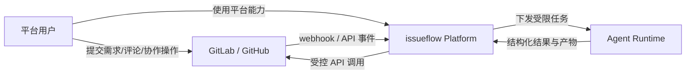

# issueflow 设计说明

## 概览要点

- `issueflow` 是一个面向组织级交付流程的 AI 自动化平台，不只是代码生成工具。
- 平台重点是把 `Issue -> PR/MR` 流程做成受控、可审计、可沉淀的标准化系统。
- 权限控制基于零信任边界与状态机，而不是把高权限直接交给 agent。
- 平台级 skill 负责沉淀和复用经验，帮助产品、设计、研发、测试等角色更快完成工作。
- 平台具备较强的 agent 交互能力，可通过 AG-UI、A2UI 等方式交互式操作 GitLab / GitHub。
- 平台可对接飞书等办公工具，把 issue 管理和协作流程延伸到办公场景。
- 当前主支持路径是 `GitLab + OpenCode + GitLab CI`，并保留后续扩展到更多平台的空间。

## 架构总览

模块与通信方向：

- `平台用户`：包括产品、设计、研发、测试等角色；向平台或代码托管平台发起需求、评论、确认和协作动作。
- `GitLab / GitHub`：承载 issue、PR/MR、评论与代码协作；向 `issueflow Platform` 发送 webhook 或事件，并接收平台的受控写操作。
- `issueflow Platform`：系统控制平面；负责状态机、权限控制、流程编排、平台集成、平台级 skill 管理、交互式 agent 会话协调和结果回写。
- `Agent Runtime`：负责执行具体 agent 任务并返回结构化结果；可通过 AG-UI、A2UI 等方式与平台协同，当前主落地路径可运行在 GitLab CI 上，但在架构上视为独立执行服务。

## 设计目标

`issueflow` 关注的是把 `Issue -> PR/MR` 交付流程做成一套受控、可审计、可沉淀的组织级自动化系统，而不是让单个 AI agent 直接持有过大的仓库权限。

核心设计目标包括：

- 让 `issue -> PR/MR` 交付更结构化、可自动化、可观测。
- 将个人经验沉淀为团队可复用的自动化能力。
- 为 AI agent 建立明确安全边界，而不是默认信任。
- 将平台集成、执行环境、权限控制与交付流程统一纳入治理。

## 工作流重点

目标工作流包含以下阶段：

- issue 接收与校验
- 明确触发开发开始
- 计划生成与确认
- 实现与验证
- PR/MR 状态跟踪与后续处理

具体平台集成可随时间演进，但工作流模型是稳定内核。

## 核心特性展开

### 1. 零信任加状态机的安全模型

系统通过零信任边界和状态机共同控制 agent 权限：

- 代理不直接持有高权限平台凭据。
- 高风险写操作统一收敛到 Gateway。
- 每个 issue 或 MR 在不同阶段，只能调用对应阶段允许的动作。
- 即使执行组件请求越权操作，Gateway 也需要在策略层做最终校验。

这种方式可以把权限控制和工作流状态绑定，避免 agent 在未获授权时提前推分支、创建 MR 或触发发布。

### 2. 自动化能力沉淀

`issueflow` 不希望自动化能力依赖个人经验，而是希望沉淀成组织级资产：

- 将常见研发动作抽象成可复用的 skill 或工作流节点。
- 统一管理 issue 处理、计划生成、实现、验证、发布等流程能力。
- 形成类似 skillclaw 的一体化 skill 中心，持续复用和迭代。
- 通过平台级 skill 帮助产品、设计、研发、测试等角色更快速地完成各自工作。

### 3. 深度 GitLab 集成

当前主要支持路径是 `GitLab + OpenCode`，并围绕 GitLab 建立深度集成：

- 通过 webhook 接收 issue、评论和状态事件。
- 通过 GitLab CI 执行机器人任务和交付流水线。
- 将 MR、校验、发布等能力纳入统一状态机控制。
- 尽可能把研发过程中的重复操作自动化。

### 4. 统一环境与密钥管理

为了更适合企业与团队场景，agent 的运行环境和密钥应统一治理：

- 集中管理 agent 执行环境。
- 统一发放与管理 API Key。
- 让用量、成本、责任归属和审计信息更清晰。
- 降低个人手工配置差异带来的效果波动。

### 5. 统一平台授权与跨角色协作

`issueflow` 不应只服务于有代码仓库写权限的开发者，也应服务于完整的产品交付链路：

- 统一对接 GitLab / GitHub 授权体系，减少多平台分散配置。
- 将平台权限与工作流能力结合，而不是简单等同于代码提交权限。
- 让产品、设计、项目管理、测试、研发等不同角色都可以在同一平台上参与需求推进。
- 即使没有代码权限，也可以通过平台完成需求整理、需求设计、流程推进和协作反馈。

这样可以把 AI 能力从“写代码工具”扩展为“面向全角色的产品交付协作平台”。

### 6. 强交互式 Agent 操作

`issueflow` 不只是把 agent 当作一次性任务执行器，也强调 agent 与平台、代码托管系统之间的持续交互能力：

- 支持通过 AG-UI、A2UI 等交互式方式操作 GitLab / GitHub。
- 让 agent 可以在需求推进、信息补充、评论反馈、状态确认等环节持续参与。
- 相比静态脚本调用，更适合处理需要人机协作和多轮反馈的流程。
- 让平台能够承载更强的交互式自动化，而不只是单次执行任务。

### 7. 办公工具对接

`issueflow` 不应局限于代码托管平台内部，也需要进入团队日常协作环境：

- 支持与飞书等办公工具打通。
- 可将 issue 管理、状态同步、协作通知等能力延伸到办公场景。
- 让需求推进、任务分发和流程确认不必只发生在 GitLab / GitHub 内部。
- 降低非研发角色参与流程的门槛，增强跨团队协作效率。

## 项目能力

当前能力范围：

- 接收 GitLab webhook 事件并转换为工作流状态迁移
- 通过 `/start-dev` 等显式命令作为开发工作的准入门槛
- 在受限上下文与关联 ID（correlation ID）下触发 GitLab CI 机器人任务
- 在 CI 中运行 OpenCode 作为受约束执行组件
- 将 MR 创建、发版请求等 GitLab 写操作收敛到 Gateway 侧执行
- 应用基于阶段的权限策略，使每个 issue 仅能调用其生命周期当前阶段允许的 GitLab API
- 让 MR、打包、部署与发布流水线与机器人工作流保持一致

## 零信任代理边界

本仓库对编码代理采用零信任架构。

- `Gateway` 持有真实的 GitLab `personal access token`（PAT）或其他高权限集成凭据。
- `OpenCode` 不接收真实 PAT。
- `OpenCode` 只接收 CI 任务环境与传入该任务的最小必要上下文。
- 高权限 GitLab 操作由 `Gateway` 代理，不由 `OpenCode` 直接执行。
- CI 输出在 `Gateway` 完成阶段与动作合法性校验前，均视为不受信任的工作流输入。

这意味着以下动作应通过 `Gateway`：

- 创建合并请求（MR）
- 请求或执行发布动作
- 写入受保护的工作流评论或状态更新
- 调用在流程未到达目标阶段前应被阻止的 GitLab API

## 基于阶段的权限控制

`Gateway` 应将 issue 生命周期阶段映射为允许的 GitLab API 操作。

示例策略形态：

- `issue-created`：仅允许分诊与澄清；不允许创建 MR
- `validated`：允许校验反馈与计划准备；暂不允许代码贡献
- `start-dev-approved`：允许机器人分支准备、实现流程与 MR 创建
- `mr-open`：允许验证、后续评论与状态更新
- `release-approved`：允许发布准备与发布操作

有一条具体规则尤其重要：

- 在 `/start-dev` 被接收并确认前，工作流不得创建或提交合并请求

这样可将仓库写权限绑定到显式工作流状态，而非代理自由裁量。

推荐的阶段-动作策略：

| 工作流域 | 阶段 | 通过 Gateway 允许的 GitLab 动作 | 阻止示例 |
| --- | --- | --- | --- |
| Issue | `new` | 读取 issue、写澄清评论、触发分诊 | 创建 MR、推送分支、发布版本 |
| Issue | `triaging` | 写分诊反馈、请求更多信息、触发校验 | 创建 MR、推送分支 |
| Issue | `needs-info` | 仅写澄清评论 | 创建 MR、触发实现 |
| Issue | `validated` | 写校验总结、准备下一步 | 创建 MR、推送分支 |
| Issue | `awaiting-start-command` | 等待显式 `/start-dev`，写状态评论 | 创建 MR、推送分支 |
| Issue | `mr-opened` | 更新 issue 与 MR 关联，继续流程回调 | 无限制发布 |
| MR | `draft-plan` | 写计划草稿、更新 MR 描述 | 推送实现分支 |
| MR | `awaiting-plan-confirm` | 等待确认、写提醒评论 | 推送实现分支、执行验证 |
| MR | `approved-for-dev` | 创建机器人分支、更新 MR 元数据 | 发布版本 |
| MR | `in-dev` | 推送机器人提交、更新 MR、触发验证 | 发布版本 |
| MR | `verifying` | 运行验证流程、更新 MR 检查摘要 | 发布版本 |
| Release | `idle` | 触发发布准备 | 发布版本 |
| Release | `release-checking` | 写发布准备摘要 | 发布版本 |
| Release | `ready-for-release` | 发布版本、写发布结果 | 绕过 Gateway 由代理直接发布 |

即使是 CI 或代理发起请求，Gateway 策略层也应在调用 GitLab API 前评估这些权限。

## 当前支持定位

- 代码托管与 CI 集成不被视为硬性产品边界。
- 当前主要支持组合是 `GitLab + OpenCode`。
- `GitLab CI` 是当前主要机器人执行平面。
- 除非已实现，仓库不应暗示其他平台集成已可用。

## 当前实现状态

- `Robot Gateway` 已使用 Rust 实现。
- Gateway 的确认页与状态页保持为轻量服务端渲染页面。
- Gateway 持久化在生产环境使用 `PostgreSQL`，默认集成测试流程使用嵌入式 `SQLite`。
- `Agent Workbench` 仍处于规划阶段，尚未实现。
- 可复用的 GitLab CI 集成模板现位于 `scripts/robot/integrations/gitlab-ci/`。

## 近期方向

- 保持 Gateway 基础层轻量且可靠。
- 保持工作流逻辑与 CI 平台适配器分离。
- 在扩展平台覆盖前，先强化 `issue -> PR/MR` 流程周边自动化。

## GitLab CI 集成

仓库提供了一个可复用的 GitLab CI 集成，用于基于 Docker 的机器人与交付流水线：

- 模板：`scripts/robot/integrations/gitlab-ci/gitlab-ci.robot.yml`
- 分发器：`scripts/robot/integrations/gitlab-ci/run-job.sh`
- 文档：`scripts/robot/integrations/gitlab-ci/README.md`

其覆盖以下流程：

- 基于触发器的机器人任务
- 合并请求编译与测试
- 默认分支打包与预发布环境部署
- 基于 tag 的发布构建与发布

该集成 README 说明了设计、必需变量与命令参数。
