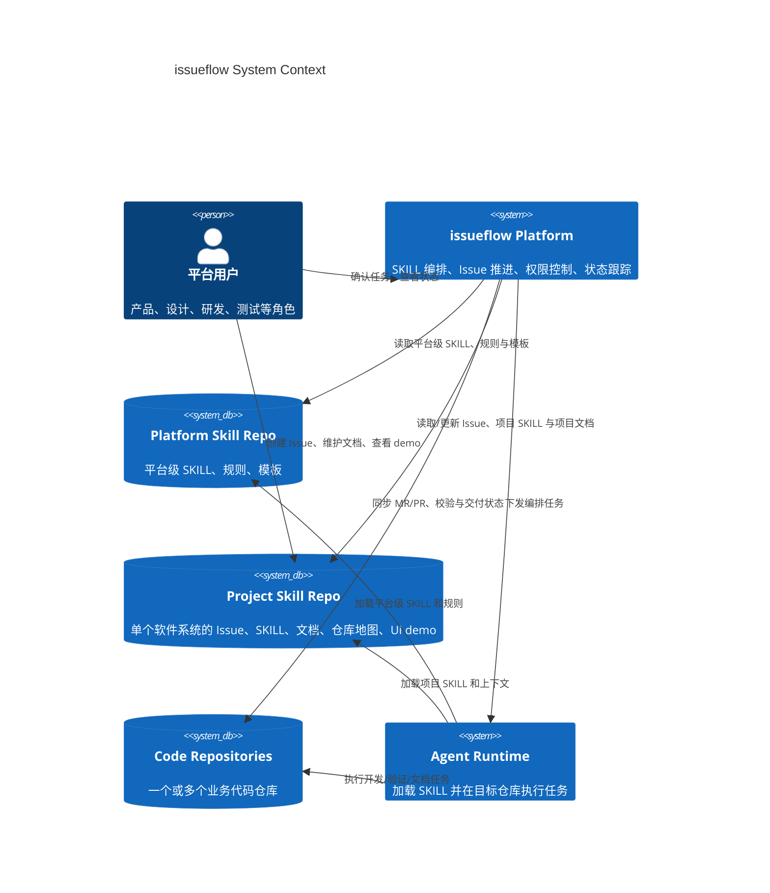

# issueflow 设计说明

## 概览要点

- `issueflow` 是一个面向组织级研发协作的 Agent 编排平台，不只是代码生成工具。
- 平台以 `Anthropic SKILLS` 为一等公民，用 `SKILL` 来承载方法、规范、模板、上下文与执行约束。
- Git 不只是代码托管介质，也是 `SKILL` 的存储、版本管理、历史追踪与审计系统。
- 平台推荐采用双层 `skill repo` 模型：`<platform-skill-repo>` 负责系统级 skills 与规则，`<project-skill-repo>` 面向单个软件系统，负责项目级 issue、skills、仓库地图、规则文档与持续演进的 UI demo。
- 平台重点是把 `Issue -> PR/MR` 等交付流程做成受控、可审计、可沉淀的标准化系统。
- 当前主支持路径是 `GitLab + OpenCode + GitLab CI`，但平台抽象不以单一代码托管平台或 CI 平台为永久边界。

## 架构总览

模块与通信方向：

- `平台用户`：包括产品、设计、研发、测试等角色；可以在项目级 `skill repo` 中推进单个软件系统的 issue、更新文档和查看 demo。
- `Platform Skill Repo`：平台知识主仓；统一承载系统级 `SKILL`、规则、模板和编排约束。
- `Project Skill Repo`：单个软件系统的知识主仓；统一承载 issue、项目 `SKILL`、SOP、架构文档、仓库索引和产品/UI demo。
- `Code Repositories`：被编排的业务仓库；可以是单仓，也可以是多仓项目下的多个代码库。
- `issueflow Platform`：系统控制平面；负责技能匹配、任务拆分、状态机、权限控制、平台集成和结果聚合。
- `Agent Runtime`：执行具体 agent 任务并返回结构化结果；同时加载平台级与项目级 `SKILL`，当前主落地路径可运行在 `GitLab CI` 上，但在架构上视为可替换执行层。

## 设计目标

`issueflow` 关注的是把组织里的交付能力沉淀成一套围绕 `SKILL` 演进的系统，而不是让单个 AI agent 直接持有过大的仓库权限并临场拼装工作流。

核心设计目标包括：

- 让 `Issue -> PR/MR` 交付更结构化、可自动化、可观测。
- 让 `SKILL` 成为组织级资产，而不是零散的个人提示词。
- 用 Git 管理 `SKILL`、规则与历史，让知识天然版本化、可审计。
- 为平台提供一个系统级主仓来管理通用 skills、规则与模板。
- 为单个软件系统提供一个稳定的项目级主仓，用于统一管理 issue、文档、demo 和仓库地图。
- 为 AI agent 建立明确安全边界，而不是默认信任。

## 工作流重点

目标工作流包含以下阶段：

- issue 接收与校验
- `SKILL` 选择或组合
- 计划生成与确认
- 实现与验证
- PR/MR 状态跟踪与后续处理
- 文档、demo 与 `SKILL` 的持续沉淀

具体平台集成可随时间演进，但工作流模型是稳定内核。

## 核心特性展开

### 1. `Anthropic SKILLS` 一等公民

`issueflow` 将 `SKILL` 视为平台中的显式对象，而不是附着在某次执行中的临时提示词：

- `SKILL` 用于承载执行规范、上下文、模板、约束与最佳实践。
- `SKILL` 可以被审查、组合、版本化和持续演进。
- 平台围绕 `SKILL` 匹配、执行、沉淀和复用来组织工作流。
- 组织可以持续把有效经验固化进 `SKILL`，而不是依赖个别高手的即时操作。

### 2. Git Native 的技能与知识系统

`issueflow` 不把 Git 仅仅看作代码仓库，而是把它作为 `SKILL` 与项目知识的系统底座：

- 用 Git 管理 `SKILL`、SOP、模板、提示上下文和演进历史。
- 让所有重要规则与协作资产天然具备版本、diff、review 和回滚能力。
- 让团队可以围绕同一套 Git 工作流治理代码、文档、demo 和自动化能力。
- 让“沉淀出来的做法”能够像代码一样持续维护。

### 3. 项目级 Skill Repo

`issueflow` 采用双层 `skill repo` 模型：

- `<platform-skill-repo>` 负责平台级通用 `SKILL`、规则、模板和编排协议。
- `<project-skill-repo>` 面向单个软件系统，负责该项目自己的 issue、项目级 `SKILL`、仓库地图和 demo。

对于单个软件系统，`issueflow` 推荐使用一个项目级 `skill repo` 作为协调中心：

- 在同一个仓库中统一管理项目 issue。
- 在 `skills/` 中沉淀该项目需要长期复用的 `Anthropic SKILLS`。
- 维护仓库地图，说明其它代码仓库在哪里、各自负责什么。
- 维护架构文档、SOP 和协作规则。
- 持续维护 UI demo，帮助产品设计者更直观地迭代系统设计。

这样，平台级通用能力和项目级专有能力被分层管理，既能复用，也能保持每个软件系统的独立沉淀空间。

### 4. 多仓库项目管理与交付编排

`issueflow` 不只面向单仓代码生成，也强调项目级协调能力：

- 可以围绕一个项目上下文编排多个业务仓库。
- 可以根据平台级与项目级 `SKILL` 将任务拆分到不同仓库执行。
- 可以聚合多个仓库的 MR/PR、验证、发布和状态结果。
- 可以把项目级文档、demo 与代码交付同步推进。

### 5. 零信任加状态机的安全模型

系统通过零信任边界和状态机共同控制 agent 权限：

- 代理不直接持有高权限平台凭据。
- 高风险写操作统一收敛到 Gateway。
- 每个 issue 或 MR 在不同阶段，只能调用对应阶段允许的动作。
- 即使执行组件请求越权操作，Gateway 也需要在策略层做最终校验。

这种方式可以把权限控制和工作流状态绑定，避免 agent 在未获授权时提前推分支、创建 MR 或触发发布。

### 6. 持续演进的产品资产

`issueflow` 认同“code is cheap，idea 需要持续迭代优化”的工作方式，因此平台不只产出代码：

- 支持持续维护 UI demo、架构草图与设计说明。
- 让产品设计者、研发和 agent 围绕同一套项目上下文协作。
- 让 demo 与文档成为设计和实现之间的桥梁，而不是一次性产物。
- 让项目在推进过程中不断刷新自己的 `SKILL` 和知识库，同时把可复用部分上提回平台级能力。

### 7. 当前可用执行路径

当前主要支持路径是 `GitLab + OpenCode`，并围绕 GitLab 建立较深集成：

- 通过 webhook 接收 issue、评论和状态事件。
- 通过 `GitLab CI` 执行机器人任务和交付流水线。
- 将 MR、校验、发布等能力纳入统一状态机控制。
- 在现有路径上验证通用化的 `SKILL` 编排模型。

## 项目能力

当前能力范围：

- 接收 GitLab webhook 事件并转换为工作流状态迁移。
- 通过 `/start-dev` 等显式命令作为开发工作的准入门槛。
- 在受限上下文与关联 ID（correlation ID）下触发 GitLab CI 机器人任务。
- 在 CI 中运行 OpenCode 作为受约束执行组件。
- 将 MR 创建、发版请求等 GitLab 写操作收敛到 Gateway 侧执行。
- 应用基于阶段的权限策略，使每个 issue 仅能调用其生命周期当前阶段允许的 GitLab API。
- 让 MR、打包、部署与发布流水线与机器人工作流保持一致。

## 零信任代理边界

本仓库对编码代理采用零信任架构。

- `Gateway` 持有真实的 GitLab `personal access token`（PAT）或其他高权限集成凭据。
- `OpenCode` 不接收真实 PAT。
- `OpenCode` 只接收 CI 任务环境与传入该任务的最小必要上下文。
- 高权限 GitLab 操作由 `Gateway` 代理，不由 `OpenCode` 直接执行。
- CI 输出在 `Gateway` 完成阶段与动作合法性校验前，均视为不受信任的工作流输入。

这意味着以下动作应通过 `Gateway`：

- 创建合并请求（MR）
- 请求或执行发布动作
- 写入受保护的工作流评论或状态更新
- 调用在流程未到达目标阶段前应被阻止的 GitLab API

## 基于阶段的权限控制

`Gateway` 应将 issue 生命周期阶段映射为允许的 GitLab API 操作。

示例策略形态：

- `issue-created`：仅允许分诊与澄清；不允许创建 MR
- `validated`：允许校验反馈与计划准备；暂不允许代码贡献
- `start-dev-approved`：允许机器人分支准备、实现流程与 MR 创建
- `mr-open`：允许验证、后续评论与状态更新
- `release-approved`：允许发布准备与发布操作

有一条具体规则尤其重要：

- 在 `/start-dev` 被接收并确认前，工作流不得创建或提交合并请求

这样可将仓库写权限绑定到显式工作流状态，而非代理自由裁量。

推荐的阶段-动作策略：

| 工作流域 | 阶段 | 通过 Gateway 允许的 GitLab 动作 | 阻止示例 |
| --- | --- | --- | --- |
| Issue | `new` | 读取 issue、写澄清评论、触发分诊 | 创建 MR、推送分支、发布版本 |
| Issue | `triaging` | 写分诊反馈、请求更多信息、触发校验 | 创建 MR、推送分支 |
| Issue | `needs-info` | 仅写澄清评论 | 创建 MR、触发实现 |
| Issue | `validated` | 写校验总结、准备下一步 | 创建 MR、推送分支 |
| Issue | `awaiting-start-command` | 等待显式 `/start-dev`，写状态评论 | 创建 MR、推送分支 |
| Issue | `mr-opened` | 更新 issue 与 MR 关联，继续流程回调 | 无限制发布 |
| MR | `draft-plan` | 写计划草稿、更新 MR 描述 | 推送实现分支 |
| MR | `awaiting-plan-confirm` | 等待确认、写提醒评论 | 推送实现分支、执行验证 |
| MR | `approved-for-dev` | 创建机器人分支、更新 MR 元数据 | 发布版本 |
| MR | `in-dev` | 推送机器人提交、更新 MR、触发验证 | 发布版本 |
| MR | `verifying` | 运行验证流程、更新 MR 检查摘要 | 发布版本 |
| Release | `idle` | 触发发布准备 | 发布版本 |
| Release | `release-checking` | 写发布准备摘要 | 发布版本 |
| Release | `ready-for-release` | 发布版本、写发布结果 | 绕过 Gateway 由代理直接发布 |

即使是 CI 或代理发起请求，Gateway 策略层也应在调用 GitLab API 前评估这些权限。

## 当前支持定位

- 代码托管与 CI 集成不被视为硬性产品边界。
- 当前主要支持组合是 `GitLab + OpenCode`。
- `GitLab CI` 是当前主要机器人执行平面。
- 除非已实现，仓库不应暗示其他平台集成已可用。

## 当前实现状态

- `Robot Gateway` 已使用 Rust 实现。
- Gateway 的确认页与状态页保持为轻量服务端渲染页面。
- Gateway 持久化在生产环境使用 `PostgreSQL`，默认集成测试流程使用嵌入式 `SQLite`。
- `Agent Workbench` 仍处于规划阶段，尚未实现。
- 可复用的 GitLab CI 集成模板现位于 `scripts/robot/integrations/gitlab-ci/`。

## 近期方向

- 保持 Gateway 基础层轻量且可靠。
- 保持工作流逻辑与 CI 平台适配器分离。
- 先把 `<platform-skill-repo>` 与 `<project-skill-repo>` 的双层模型说明清楚，再逐步扩展平台覆盖面。
- 在扩展平台覆盖前，先强化当前 `GitLab + OpenCode + GitLab CI` 路径上的工作流闭环。

## GitLab CI 集成

仓库提供了一个可复用的 GitLab CI 集成，用于基于 Docker 的机器人与交付流水线：

- 模板：`scripts/robot/integrations/gitlab-ci/gitlab-ci.robot.yml`
- 分发器：`scripts/robot/integrations/gitlab-ci/run-job.sh`
- 文档：`scripts/robot/integrations/gitlab-ci/README.md`

其覆盖以下流程：

- 基于触发器的机器人任务
- 合并请求编译与测试
- 默认分支打包与预发布环境部署
- 基于 tag 的发布构建与发布

该集成 README 说明了设计、必需变量与命令参数。
