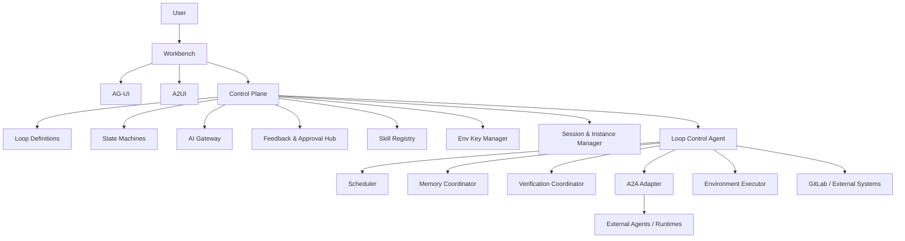

# issueflow 系统设计

一个面向 **Loop Engineering** 的控制平面

- Loop 优先于 prompt
- Verification 优先于 generation
- Memory 必须落盘
- Human-in-the-loop 是主路径

---

# 1. 这不是另一个通用 Agent

`issueflow` 不试图重做：

- 通用聊天助手
- AI IDE
- 单一 vendor 的 agent runtime

`issueflow` 真正要做的是：

- 管理长期运行的 **Loop**
- 管理 **状态、预算、权限、验证、记忆**
- 编排外部 agent / runtime / toolchain
- 把人工确认和治理闭环放到系统中心

---

# 2. 系统核心问题

普通 agent 系统更擅长：

- 单次问答
- 单次生成
- 局部自动化

`issueflow` 要解决的是：

- 一个工作对象如何被持续推进
- 一次运行之后系统记住了什么
- 什么时候该继续，什么时候该停
- 谁来确认写操作
- 多个 agent、skill、runtime 如何协同

---

# 3. 核心设计结论

系统的核心不是“模型”，而是这 6 个对象：

1. **Loop**
2. **Turn / Run**
3. **Memory**
4. **Approval / Pending Action**
5. **Skill**
6. **Agent**

这决定了它更像一个 **工作流控制系统**，而不是聊天系统。

---

# 4. 总体架构

---

# 5. Control Plane 做什么

Control Plane 是平台层，不是执行器。

它负责：

- Loop 定义管理
- 状态机管理
- 预算与策略管理
- 人工确认与反馈
- Skill 注册与版本管理
- Session / Instance 生命周期管理
- 环境密钥与权限边界

一句话：

> **Control Plane 决定系统允许做什么。**

---

# 6. Loop Control Agent 做什么

Loop Control Agent 不直接承担所有重型执行，它更接近：

- orchestrator
- manager
- judge
- persistence coordinator

它负责：

- 根据预算决定执行范围和强度
- 规划任务
- 调起子 Agent
- 跟进子 Agent 执行中的问题
- 聚合结果
- 触发 evaluator
- 更新任务状态与总结
- 生成待确认动作与治理信号

---

# 7. 一个 Turn / Run 的内部结构

每次执行不是“问一次模型”，而是一个完整 turn：

1. **trigger**  
   manual / schedule / event

2. **execute**  
   executor 调用 skill / agent / runtime

3. **evaluate**  
   evaluator 独立确认结果

4. **conclude**  
   形成结论性消息、memory 更新、pending actions

5. **persist**  
   event log + loop memory + engineering memory

---

# 8. Executor 与 Evaluator 分离

这是当前设计和很多普通 agent 系统的关键差异。

分工：

- **executor** 负责执行
- **evaluator** 负责确认
- **上层 Loop** 使用 evaluator 产出的结论性消息

这样可以避免：

- 生成即结论
- 自证闭环
- 多轮复用旧结论但不重验

---

# 9. Memory 不是 Transcript

Memory 是系统能力，不是单纯消息历史。

当前分层：

| 层 | 作用 |
| --- | --- |
| session memory | 运行事件与消息回放 |
| loop memory | 单个 loop 跨轮状态 |
| engineering memory | 对工程对象的当前理解 |
| governance memory | 风险、反馈、演进信号 |

实现决策：

- 当前可采用 **mem0**
- 后端只依赖稳定 memory 接口
- 未来可替换实现，但接口不变

---

# 10. 写操作默认不直达外部系统

默认原则：

- 读可以自动进行
- 写默认进入 **pending action**

典型待确认动作：

- GitLab comment
- Issue / MR 更新
- 环境写入
- 外部系统写入

确认主体可以是：

- 人工
- 更高层 Loop
- 明确授权的系统策略

---

# 11. Human-in-the-loop 不是末端审批

人工不是只在最后点一个“通过”。

系统必须支持不同强度的介入：

- 停止一个工具调用
- 发送 steering 消息
- 停止本次 run
- 停止整个 loop
- manual takeover

这意味着系统底层必须兼容：

- 消息队列 / 事件流
- 可取消执行
- 状态机中途转向
- agent 生命周期管理

---

# 12. Skill 的位置

Skill 既不是单纯 prompt，也不是单纯 runtime 插件。

Skill 在系统中的位置是：

- Loop 引用它
- Runtime 执行它
- Registry 管理它
- Evaluator 约束它

Skill 需要支持：

- scope
- version
- compatibility
- input / output contract
- required permissions
- evaluation requirements

---

# 13. Runtime 分层

当前设计里，runtime 不是一层，而是分层的：

1. **Loop Core Runtime**
   - 常驻服务端
   - 负责 orchestration

2. **Skill Host**
   - 可受限执行 skill
   - 可考虑 Wasmtime/WASI

3. **External Agent Runtime**
   - OpenCode / Codex / Hermes / OpenClaw 等

4. **Environment Executor**
   - 浏览器、受控环境、工具执行

---

# 14. 调度与运行

调度不是简单 cron。

设计要求支持：

- 固定周期
- 时间窗
- 事件触发
- 条件继续
- retry / backoff

当前原型方向里：

- 固定调度可采用 **Temporal**
- 重点先解决 **Loop -> Run 的稳定触发**
- 资源调度与隔离先不作为原型重点

---

# 15. AI Gateway 为什么单独存在

AI Gateway 不是 SDK 包装层，而是治理中枢。

它负责：

- 模型路由
- token 预算
- provider 权限
- secret 使用
- tool allowlist
- 成本归集

没有 Gateway 的问题是：

- 预算散落
- 权限散落
- fallback 不可控
- 审计不完整

---

# 16. Session / Run / Instance 为什么要分开

三者职责不同：

| 对象 | 作用 |
| --- | --- |
| Session | 用户可见上下文 |
| Run | 一次具体执行 |
| Instance | 实际资源占用实体 |

如果不分开，会混淆：

- 用户历史
- 一次执行的生命周期
- 外部 runtime / browser / sandbox 资源

---

# 17. 为什么这套设计比图里的“普通 Loop 架构”更重

更重的地方主要在：

- Control Plane 被明确拆出来
- Feedback & Approval Hub 是核心层
- AG-UI / A2UI / A2A 三层协议分工明确
- Memory 是对象层，不只是记忆服务
- Verification 被单独抬成系统能力
- Security / Env / Secret 是一级边界
- Skill Evolution 是显式工作流

也就是说：

> 我们不是只做“能跑起来的 loop”，而是做“可治理、可审计、可进化的 loop 系统”。

---

# 18. Prototype / MVP / Full System

### MVP

先验证最小闭环：

- 一个 workbench = 一个 loop
- 一个工作对象持续推进
- 有 memory
- 有 pending action
- 有审批

### Prototype

表达完整系统结构：

- Loops
- Runs
- Approvals
- Memory
- Settings
- System（Agents / Skills / AI Gateway / Governance）

### Full System

补齐：

- 多 runtime
- 复杂调度
- skill evolution
- environment execution
- 完整治理闭环

---

# 19. 最终判断

`issueflow` 的核心价值不是：

- 模型更强
- prompt 更复杂
- agent 更多

而是：

> **把 Loop、Memory、Approval、Verification、Budget、Skill、Runtime、Human Intervention 组织成一个长期运行的系统。**

---

# 20. 一句话结论

`issueflow` 是一个：

## **以 Loop 为一等对象的 Agent Control Plane**

它的重点不是“生成”，而是：

- 持续推进
- 验证结论
- 保持记忆
- 约束写操作
- 接受人工介入
- 通过运行反过来进化系统

