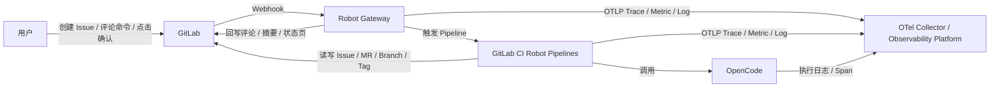
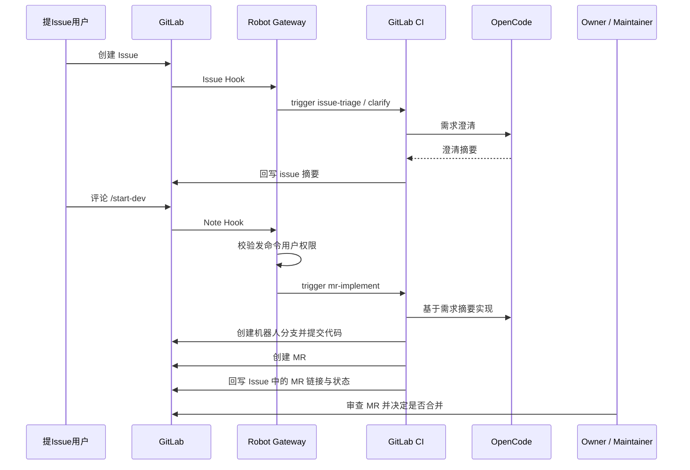
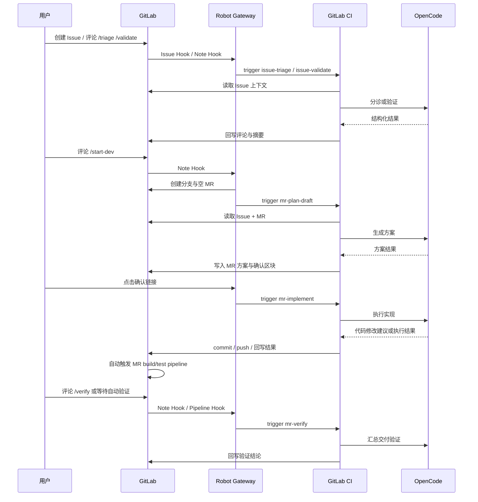
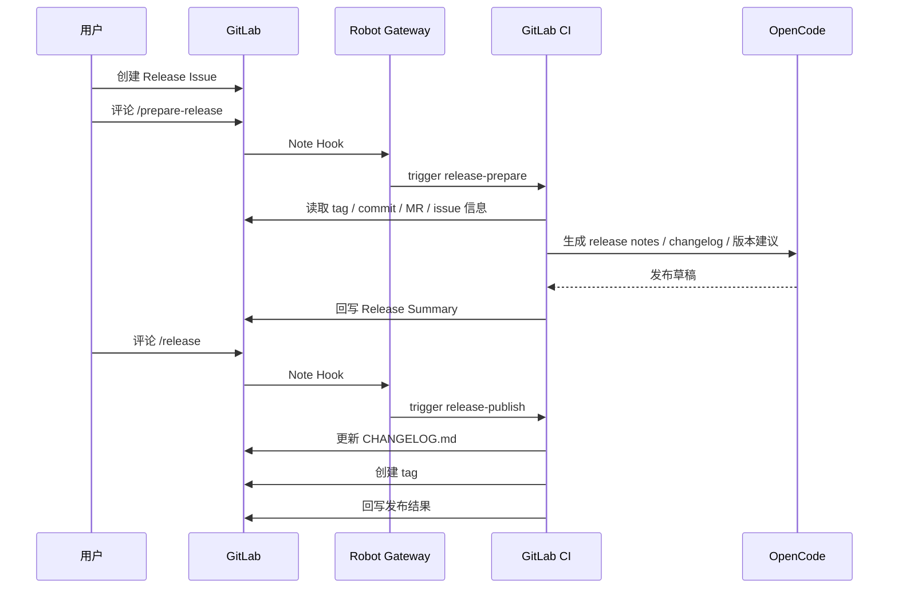
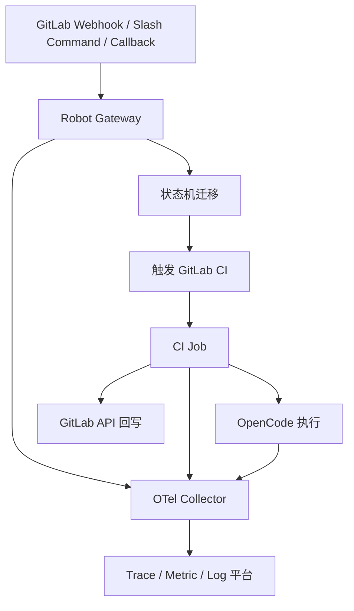

# GitLab 云原生与智能化软件开发机器人设计方案

## 概述

设计一个基于 `GitLab`、`OpenCode`、`GitLab CI` 和 `GitLab Webhook` 的云原生与智能化软件开发机器人。

机器人通过 GitLab 事件触发，在项目交付过程中的关键时机介入。核心流程为：

`Issue -> 分诊/验证 -> 显式 /start-dev -> 空 MR -> 方案生成 -> 点击确认 -> 实现开发 -> 验证`

设计目标是让面向云原生与智能化软件开发的 AI coding 过程可控、可追踪，并且与现有 GitLab 工作流紧密结合。

## 目标

1. 帮助用户对 issue 做分诊和问题验证。
2. 只有在收到明确命令时才进入开发阶段。
3. 在实现前先创建空 MR，并在 MR 内完成方案评审。
4. 只有在方案确认后才开始实现。
5. 以 GitLab CI 作为机器人逻辑的主要执行平面。
6. 为 GitLab 增加更适合 AI coding 的项目管理能力。
7. 面向云原生交付、平台工程和智能化软件开发提供统一工作流。
8. 支持通过 slash command 驱动版本准备与发布。

## 非目标

1. 多级审批。
2. 第一版不做基于 GitLab OAuth 的强身份校验。
3. 自动合并。
4. 跨项目依赖规划。
5. 长期记忆或知识库。
6. 第一版不做自动生产部署。

## 架构

系统严格限制为两个服务。

### 服务 1：Robot Gateway

职责：

1. 接收 GitLab webhook。
2. 校验 webhook secret 并解析事件。
3. 识别 issue 或 MR 评论中的 slash 命令。
4. 存储最小工作流状态。
5. 生成和校验一次性签名方案确认链接。
6. 触发对应的 GitLab CI pipeline。
7. 回写 issue 和 MR 的评论及摘要区块。
8. 提供轻量级交互页面和结果页。

Gateway 应保持轻量，不承担复杂推理。

Gateway 建议使用 `Rust` 开发，推荐技术栈：

1. `axum`
2. `tokio`
3. `sqlx`
4. `reqwest`
5. `tracing` + `opentelemetry`

这样更适合云原生部署、异步 webhook 编排、状态机管理和 OTel 接入。

### Robot Gateway 轻量交互能力预留

Gateway 不应只是纯 webhook 转发器，需要预留少量面向用户的轻交互能力。

第一版建议支持：

1. 方案确认结果页
2. 发布结果页
3. 简单状态页

后续可扩展：

1. 轻量参数补充表单
2. 发布确认页
3. 回滚确认页

设计原则：

1. 只做轻交互，不做完整管理后台。
2. 页面只负责展示状态和收集少量确认信息。
3. 业务状态仍由 Gateway 状态机管理。
4. 页面层不承载复杂业务逻辑。

### 服务 2：GitLab CI Robot Pipelines

职责：

1. 承载全部机器人执行逻辑。
2. 在 CI job 中调用 OpenCode。
3. 执行 issue 分诊。
4. 执行 issue 验证。
5. 生成 MR 方案。
6. 在确认后辅助实现开发。
7. 运行验证并发布结果。
8. 支撑独立的 release 准备与发布流程。

OpenCode 在本设计中不是独立服务，而是 CI job 内部调用的能力组件。

### 独立 Agent 工作台

除了 Gateway 的轻量确认页和状态页外，系统还应预留一个独立的 `Agent 工作台`，面向开发者使用。

第一版定位为：

1. 任务工作台
2. 显示 issue / MR / release 当前状态
3. 显示阻塞点、下一步动作和关键摘要
4. 不替代 GitLab 作为事实协作中心

前端技术栈建议固定为：

1. `Vue 3`
2. `Naive UI`

前端范围限定为：

1. `Vue 3 + Naive UI` 仅用于独立 Agent 工作台
2. Gateway 的确认页和结果页继续保持轻量 HTML

## 实施拆分

为了便于后续排期、分工和实现，本方案建议按 `3 个工作包` 推进，而不是拆成过细的小模块。

### 工作包总览

| 工作包 | 范围 | 主要产出 | 依赖关系 |
| --- | --- | --- | --- |
| Robot Gateway | webhook、slash command、状态机、GitLab API 封装、确认回调、轻量交互页面、OTel 接入、受限权限贡献编排、release 编排 | 可运行的 Gateway 服务、状态机、页面路由、GitLab 集成层 | 依赖 GitLab Token、数据库、OTel 接入信息 |
| GitLab CI Robot Pipelines | issue triage / validate、MR plan / implement / verify、release prepare / publish、与正常交付流程协同 | `.gitlab-ci.yml`、robot job 脚本、回写逻辑、验证与发布任务 | 依赖 Gateway 触发、Runtime Image、GitLab 仓库权限 |
| OpenCode Runtime Image | OpenCode 安装、skills 安装、云原生工具链、丰富软件包、统一运行环境 | Dockerfile、镜像发布流程、基础工具链、skill 目录约定 | 依赖 OpenCode 版本、skill 清单、CI Runner 镜像仓库 |
| Agent 工作台 | 开发者任务面板、状态可视化、摘要查看、动作入口 | Vue 3 + Naive UI 前端、工作台页面、状态查询接口对接 | 依赖 Gateway API、OTel 查询或聚合接口 |

### 工作包 1：Robot Gateway

职责：

1. 接收 GitLab webhook。
2. 解析 slash command。
3. 执行状态机迁移。
4. 统一封装 GitLab API 调用。
5. 处理方案确认和发布确认相关回调。
6. 提供轻量结果页和状态页。
7. 上报 OTel trace、metric、log。

技术实现建议：

1. `Rust`
2. `axum`
3. `sqlx`
4. `reqwest`
5. `tracing`

这个工作包中已经包含：

1. GitLab API 集成。
2. 受限权限贡献模式的权限校验与流程编排。
3. Release Issue 驱动发布流程的入口和编排。

### 工作包 2：GitLab CI Robot Pipelines

职责：

1. 执行 `issue-triage`。
2. 执行 `issue-validate`。
3. 执行 `mr-plan-draft`。
4. 执行 `mr-implement`。
5. 执行 `mr-verify`。
6. 执行 `release-prepare`。
7. 执行 `release-publish`。
8. 与正常 build / test / package / deploy / release 流程协同。

这个工作包负责所有“机器人任务落地执行”，但不负责长生命周期状态管理。

### 工作包 3：OpenCode Runtime Image

职责：

1. 固定 OpenCode 版本。
2. 安装项目所需 skills。
3. 安装云原生工具链。
4. 安装 release、验证和文本处理相关软件包。
5. 给所有 robot jobs 提供统一运行环境。

### 工作包 4：Agent 工作台

职责：

1. 提供独立的开发者任务工作台。
2. 展示 issue / MR / release 当前状态。
3. 展示下一步动作、阻塞点和关键摘要。
4. 通过 Gateway API 发起轻量操作。

技术实现建议：

1. `Vue 3`
2. `Naive UI`
3. 按页面功能拆分组件，不承载状态机逻辑

这个工作包属于前端表现层，不改变 Gateway + CI 的核心后端架构。

这个工作包是基础设施层，不直接承载业务流程，但决定整个机器人系统的稳定性与一致性。

### 拆分原则

1. `GitLab API 集成` 不单独作为工作包，而归入 `Robot Gateway`。
2. `Release 流程` 和 `受限权限贡献模式` 不单独作为基础设施工作包，而归入 `Robot Gateway + GitLab CI Robot Pipelines` 的流程能力。
3. `OpenCode Runtime Image` 保持独立，因为它是所有 robot job 的共用基础设施。
4. `Agent 工作台` 作为独立前端工作包存在，但不改变核心后端的双服务模型。

## 模块协作总览



## 模块输入输出

| 模块 | 输入 | 输出 | 说明 |
| --- | --- | --- | --- |
| 用户 | GitLab 页面中的 issue、MR、Release Issue；Gateway 轻量结果页与确认页 | Issue 内容；评论 slash command；方案确认点击；发布命令与确认动作 | 用户是工作流的外部驱动者，负责提供需求、确认方案、触发发布 |
| GitLab | 用户创建和更新的 issue、MR、评论、tag；Gateway 和 CI 通过 API 回写的评论、描述、分支、MR、tag | Webhook 事件；Issue / MR / Note / Branch / Tag / Pipeline 数据；CI pipeline 执行环境 | GitLab 是协作中心、代码托管中心和 CI 执行入口 |
| Robot Gateway | GitLab webhook；确认链接回调；可选的 CI 内部回调；数据库中的会话状态 | 状态迁移；GitLab API 调用；GitLab CI trigger 请求；轻量页面响应；OTel trace、metric、log | Gateway 负责状态机、事件编排、确认回调和轻交互入口 |
| GitLab CI Robot Pipelines | Gateway 传入的 pipeline variables；Git 仓库内容；GitLab API 返回的 issue、MR、评论、tag、pipeline 信息；OpenCode Runtime Image 中的工具链与 skills | OpenCode 执行结果；代码变更、commit、push；评论回写、摘要更新、changelog 更新、tag 创建；验证结果与发布结果；OTel trace、metric、log | CI 是主要执行平面，负责所有机器人任务落地 |
| OpenCode | CI 组装的上下文；Runtime Image 中的 skills 与工具链 | 分诊结论；方案草稿；实现辅助结果；验证与发布文案输出；可观测性执行信息 | OpenCode 不持久保存工作流状态，只执行单次任务 |
| OTel 可观测性平台 | Gateway 上报的 trace、metric、log；CI job 上报的 trace、metric、log；OpenCode 执行链路的观测数据 | 全链路调用追踪；状态机和 job 成功率指标；错误定位和性能分析结果 | 负责跨模块观测、关联和排障 |

### 按交互类型拆分

| 交互方向 | 上游模块 | 下游模块 | 输入对象 | 输出对象 |
| --- | --- | --- | --- | --- |
| 用户协作 | 用户 | GitLab | issue、MR、评论、tag、Release Issue | GitLab 资源变更 |
| 事件通知 | GitLab | Robot Gateway | webhook payload | 状态机事件 |
| 工作流编排 | Robot Gateway | GitLab CI Robot Pipelines | pipeline variables、任务类型、关联资源标识 | 一次 CI 执行 |
| 智能处理 | GitLab CI Robot Pipelines | OpenCode | 组装后的任务上下文、skills、工具链 | 结构化结果 |
| 平台回写 | GitLab CI Robot Pipelines / Robot Gateway | GitLab | 评论、摘要、分支、MR、CHANGELOG、tag | GitLab 页面与仓库状态更新 |
| 可观测性上报 | Robot Gateway / GitLab CI / OpenCode | OTel 可观测性平台 | trace、metric、log、correlation_id | 可追踪和可分析的观测数据 |

### 关键输入输出字段

| 模块 | 关键输入字段 | 关键输出字段 |
| --- | --- | --- |
| Robot Gateway | `event_type`、`project_id`、`issue_iid`、`mr_iid`、`note`、`token`、`session_id` | `stage`、`active_pipeline_id`、`confirm_token_status`、`correlation_id` |
| GitLab CI Robot Pipelines | `ROBOT_JOB_TYPE`、`PROJECT_ID`、`RESOURCE_TYPE`、`RESOURCE_ID`、`ISSUE_ID`、`MR_ID`、`COMMENT_ID`、`TRIGGER_USER`、`CORRELATION_ID` | `robot-output/*`、评论内容、摘要内容、代码变更、tag、验证结论 |
| OpenCode | 任务上下文、仓库内容、skills、工具链 | 分诊结果、方案结果、实现结果、验证结果、发布文案 |
| OTel 可观测性平台 | `trace_id`、`span_id`、`correlation_id`、`robot_job_type`、`session_id` | trace 视图、指标面板、日志检索结果 |

## 领域对齐

本方案不是面向通用软件开发，而是优先服务以下场景：

1. 云原生应用开发
2. Kubernetes 配置与部署变更
3. Helm / Kustomize 交付内容变更
4. CI/CD 流水线变更
5. IaC 相关变更
6. AI 应用开发
7. Prompt / Agent / Tool 编排变更
8. 检索增强、模型接入和评测相关变更
9. 受限权限贡献场景下的需求驱动开发

因此，机器人在 triage、plan、verify、release 四个环节都需要带有领域模板，而不是只面向普通代码仓库。

## 任务类型模型

建议在 issue 模板中显式增加 `任务类型` 字段，至少支持：

1. 应用功能开发
2. 缺陷修复
3. 云原生配置变更
4. 交付流水线变更
5. 基础设施变更
6. AI 功能开发
7. Prompt / Agent 配置变更
8. 发布准备

不同任务类型会影响：

1. triage 的问题模板
2. MR 方案模板
3. verify 的验证项
4. release notes 的分类方式

## 受限权限贡献模式

该模式用于支持以下场景：

1. 用户可以在目标项目提 issue。
2. 用户看不到仓库代码。
3. 用户不能直接推分支或提交代码。
4. AI 在 issue 中与用户澄清需求。
5. 只有收到显式命令后，coding-agent 才开始开发。
6. coding-agent 直接在目标仓库的机器人分支提交代码并创建 MR。
7. 最终由项目 owner / maintainer 审查并合并。

### 角色边界

#### 提 issue 用户

允许：

1. 创建 issue。
2. 补充需求。
3. 与 AI 在 issue 中继续澄清。
4. 发 `/clarify` 或 `/start-dev`。

不允许：

1. 查看代码。
2. 查看实现细节。
3. 直接创建开发分支或提交 MR。

#### 项目 owner / maintainer

允许：

1. 查看 issue、MR、代码。
2. 发 `/start-dev` 或 `/cancel-dev`。
3. 审查 coding-agent 提交的 MR。
4. 合并或拒绝 MR。

#### coding-agent

允许：

1. 读取目标仓库代码。
2. 创建机器人分支。
3. commit / push。
4. 创建 MR。
5. 回写 issue / MR 摘要与结果。

不允许：

1. 自动合并 MR。
2. 自动进入生产发布。
3. 绕过显式命令直接开始开发。
4. 向无代码权限用户泄露代码细节。

### 受限权限模式下的 issue 流程

#### 状态

1. `new`
2. `clarifying`
3. `ready-for-dev-command`
4. `dev-authorized`
5. `mr-opened`

#### 主干迁移

1. 用户创建 issue -> `new`
2. AI 首次介入澄清 -> `clarifying`
3. 需求明确 -> `ready-for-dev-command`
4. 提 issue 用户或 owner / maintainer 评论 `/start-dev` -> `dev-authorized`
5. coding-agent 提交代码并创建 MR -> `mr-opened`

#### 允许命令

1. `/clarify`
   用途：重新进入需求澄清。
2. `/start-dev`
   用途：授权 coding-agent 开始开发并创建 MR。
3. `/cancel-dev`
   用途：取消当前待开发或开发中的任务。

### 受限权限模式下的协作流程



### 信息暴露边界

在无代码权限用户可见的 issue 中，只允许暴露：

1. 需求摘要。
2. 已确认范围。
3. 风险与假设。
4. 当前状态。
5. 下一步动作。
6. MR 是否已创建。

不允许暴露：

1. 代码 diff。
2. 仓库内部实现细节。
3. 敏感配置路径。
4. 大段代码片段。

### 安全与审计要求

1. `/start-dev` 只允许提 issue 用户本人或 owner / maintainer 触发。
2. Gateway 必须校验当前状态是否允许进入开发。
3. 如果已有未完成开发会话，应拒绝重复启动。
4. coding-agent 使用单独机器人身份，并采用最小权限原则。
5. 所有关键动作记录到 `robot_events`，包括：
   - issue 创建
   - `/start-dev` 触发者
   - 开发开始时间
   - 机器人分支名
   - MR 标识
   - owner 合并结果

### 设计结论

该模式的权限边界定义为：

1. 用户拥有需求驱动权。
2. coding-agent 拥有受控代码提交权。
3. owner / maintainer 拥有最终代码接纳权。

## 主流程

### Issue 阶段

1. 用户创建 issue。
2. GitLab 将 webhook 发送到 Robot Gateway。
3. Gateway 触发对应的 CI job 做分诊或验证。
4. CI 收集 issue 上下文，调用 OpenCode，并将结果回写。
5. 机器人更新：
   - issue 评论中的本次运行结果
   - issue 描述中的结构化摘要区块

在这个阶段，机器人不会自动创建 MR。

### 进入开发

只有收到明确用户命令，才进入开发流程。

第一版支持的 issue 命令为：

`/start-dev`

收到后执行：

1. Gateway 创建分支。
2. Gateway 创建空 MR。
3. Gateway 触发 `mr-plan-draft` CI pipeline。

### MR 方案阶段

1. CI 读取 issue 和 MR 上下文。
2. CI 调用 OpenCode。
3. CI 将方案内容写入 MR。
4. CI 写入带一次性签名链接的方案确认区块。
5. MR 进入 `awaiting-plan-confirm` 状态。

### 方案确认

1. 用户点击一次性签名确认链接。
2. Gateway 校验 token、过期时间、消费状态以及 MR 当前阶段。
3. 校验通过后，Gateway 将 token 标记为已消费。
4. Gateway 更新 MR 中的确认区块为最终状态。
5. Gateway 触发 `mr-implement` CI pipeline。

### 实现与验证

1. 确认成功后，CI 运行实现 job。
2. CI 使用 OpenCode 辅助修改代码。
3. CI 运行测试或项目验证命令。
4. CI 将实现结果和验证结果回写到 MR。
5. 用户也可以通过 `/verify` 触发重新验证。

### 独立发布流程

发布流程与开发主流程解耦，不从 `verify` 自动流转，而是通过独立的 slash command 驱动。

推荐入口为 `Release Issue`。

1. 用户创建 `Release Issue`。
2. 用户评论 `/prepare-release`。
3. Gateway 触发 `release-prepare` pipeline。
4. CI 自动生成 release notes 草稿、changelog 草稿和版本建议。
5. 用户确认后评论 `/release`。
6. Gateway 触发 `release-publish` pipeline。
7. CI 更新 `CHANGELOG.md`、创建 tag，并回写结果。

## Mermaid 流程图

### 开发主流程



### 独立发布流程



### 可观测性链路



## Issue 状态机

### 状态

1. `new`
2. `triaging`
3. `needs-info`
4. `validated`
5. `awaiting-start-command`
6. `mr-opened`

### 状态迁移

1. 新建 issue -> `triaging`
2. 分诊发现信息缺失 -> `needs-info`
3. 验证完成 -> `validated`
4. issue 已验证完成并等待显式开发命令 -> `awaiting-start-command`
5. 收到 `/start-dev` -> `mr-opened`

### Issue 输出

每次 issue 处理都更新两个位置：

1. Issue 评论：本次运行结果、结论和建议下一步动作。
2. Issue 描述摘要区块：当前最新的结构化状态。

## MR 状态机

### 状态

1. `draft-plan`
2. `awaiting-plan-confirm`
3. `approved-for-dev`
4. `in-dev`
5. `verifying`
6. `done`
7. `failed`

### 主干迁移

1. `/start-dev` -> `draft-plan`
2. 方案生成完成 -> `awaiting-plan-confirm`
3. 确认链接点击成功 -> `approved-for-dev`
4. 实现 pipeline 启动 -> `in-dev`
5. 实现完成 -> `verifying`
6. 验证通过 -> `done`
7. 验证失败 -> `failed`

### 补充迁移

1. 方案生成失败 -> `failed`
2. 方案修订并重新生成 -> `draft-plan`
3. 实现失败 -> `failed`
4. 修复后通过 `/verify` 重新进入验证 -> `verifying`

## Release 状态机

### 状态

1. `idle`
2. `release-checking`
3. `ready-for-release`
4. `releasing`
5. `released`
6. `release-failed`

### 主干迁移

1. `Release Issue + /prepare-release` -> `release-checking`
2. release notes、changelog、版本建议生成完成 -> `ready-for-release`
3. `/release` -> `releasing`
4. `CHANGELOG.md` 更新和 tag 创建成功 -> `released`
5. 发布失败 -> `release-failed`

### 补充迁移

1. `release-checking` 失败 -> `release-failed`
2. 修正发布范围后再次 `/prepare-release` -> `release-checking`
3. `release-failed` 后再次 `/release` 或重新准备 -> `releasing` 或 `release-checking`

## 状态机总览表

| 会话类型 | 起始事件 | 核心状态 | 结束状态 | 主要触发命令或动作 |
| --- | --- | --- | --- | --- |
| Issue Session | 新建 issue 或首次机器人介入 | `new`、`triaging`、`needs-info`、`validated`、`awaiting-start-command` | `mr-opened` 或 issue 关闭 | 自动 triage、`/triage`、`/validate`、`/start-dev` |
| MR Session | `/start-dev` 创建空 MR | `draft-plan`、`awaiting-plan-confirm`、`approved-for-dev`、`in-dev`、`verifying` | `done`、`failed`、MR 关闭或合并 | `/start-dev`、确认链接、`/verify` |
| Release Session | `Release Issue` 中首次 `/prepare-release` | `idle`、`release-checking`、`ready-for-release`、`releasing` | `released`、`release-failed`、Release Issue 取消 | `/prepare-release`、`/release` |

### 状态机职责划分

| 状态机 | 负责什么 | 不负责什么 |
| --- | --- | --- |
| Issue 状态机 | 需求分诊、问题验证、进入开发前的准备 | 不负责方案确认后的实现细节 |
| MR 状态机 | 方案确认、实现辅助、交付验证 | 不负责版本发布 |
| Release 状态机 | release notes、changelog、tag 创建 | 不负责自动从开发流程直接进入发布 |

## Session 生命周期

### 设计原则

1. `OpenCode` 任务是短生命周期的，每次由单个 CI job 驱动，执行完即结束。
2. `Robot Session` 是长生命周期的，状态保存在 Gateway 中，跨多个 OpenCode 任务延续。
3. 开发会话与发布会话分离，不从 MR 验证自动进入发布。

### 生命周期总览表

| 类型 | 开始条件 | 持续期间 | 结束条件 | 持久化主体 |
| --- | --- | --- | --- | --- |
| OpenCode 单次任务 | 某次 webhook、slash command、确认点击或发布命令触发 CI job | 单个 job 执行期间 | job 完成、失败或被取消 | 不持久化业务状态，只输出执行结果 |
| Issue Session | 新建 issue 或 issue 首次进入机器人流程 | 从 triage 到 `/start-dev` 前 | 创建空 MR、issue 关闭、人工取消 | Gateway + 数据库 |
| MR Session | `/start-dev` 成功创建空 MR | 从方案生成到实现与验证 | `done`、MR 合并、MR 关闭、人工取消、长期失败停止 | Gateway + 数据库 |
| Release Session | `Release Issue` 中首次 `/prepare-release` | 从发布准备到 changelog、tag 完成 | `released`、Release Issue 取消、人工终止、失败停止 | Gateway + 数据库 |

### OpenCode 单次任务生命周期

| 阶段 | 输入 | 动作 | 输出 | 结束条件 |
| --- | --- | --- | --- | --- |
| 触发 | webhook、slash command、确认回调、发布命令 | Gateway 触发对应 CI job | pipeline variables | job 启动成功 |
| 执行 | 任务上下文、仓库内容、skills、工具链 | OpenCode 完成单次推理与执行 | 结构化结果、建议、代码修改、文案输出 | OpenCode 返回结果 |
| 回写 | OpenCode 输出 | CI 调用 GitLab API 回写评论、摘要、tag 等 | GitLab 状态变化 | CI job 完成 |

### Issue Session 生命周期

| 阶段 | 进入条件 | 典型动作 | 退出条件 |
| --- | --- | --- | --- |
| `new` | issue 创建 | 初始记录建立 | 自动或手动进入 `triaging` |
| `triaging` | webhook 或 `/triage` | triage、摘要回写 | 进入 `needs-info` 或 `validated` |
| `needs-info` | 信息不足 | 提示补充信息 | 用户补充后再次 triage 或 validate |
| `validated` | 问题已验证 | 回写结论、等待开发命令 | 进入 `awaiting-start-command` |
| `awaiting-start-command` | 等待开发 | 无开发动作，等待命令 | `/start-dev` 或 issue 关闭 |
| 结束 | 空 MR 创建或 issue 终止 | 会话归档 | 转入 MR Session 或结束 |

### MR Session 生命周期

| 阶段 | 进入条件 | 典型动作 | 退出条件 |
| --- | --- | --- | --- |
| `draft-plan` | `/start-dev` 创建空 MR | 生成方案草稿 | 进入 `awaiting-plan-confirm` 或 `failed` |
| `awaiting-plan-confirm` | 方案已写入 MR | 等待用户点击确认链接 | 确认成功或链接失效后重生方案 |
| `approved-for-dev` | 确认成功 | 触发实现 job | 进入 `in-dev` |
| `in-dev` | 实现 job 启动 | 修改代码、提交、push | 进入 `verifying` 或 `failed` |
| `verifying` | 实现完成或 `/verify` | 交付验证、结果汇总 | 进入 `done` 或 `failed` |
| `done` | 验证通过 | 等待人工合并或后续处理 | MR 合并、关闭或归档 |
| `failed` | 方案、实现或验证失败 | 回写错误与重试建议 | `/verify`、重新生成方案、人工终止 |

### Release Session 生命周期

| 阶段 | 进入条件 | 典型动作 | 退出条件 |
| --- | --- | --- | --- |
| `idle` | Release Issue 已创建但未触发发布 | 等待 `/prepare-release` | 进入 `release-checking` |
| `release-checking` | `/prepare-release` | 汇总变更、生成 release notes 草稿、生成 changelog 草稿、建议版本号 | 进入 `ready-for-release` 或 `release-failed` |
| `ready-for-release` | 准备完成 | 等待 `/release` | 进入 `releasing` |
| `releasing` | `/release` | 更新 `CHANGELOG.md`、创建 tag、回写结果 | 进入 `released` 或 `release-failed` |
| `released` | 发布成功 | 会话归档 | 结束 |
| `release-failed` | 准备或发布失败 | 提供失败原因与重试路径 | 重新准备、重新发布或人工终止 |

### 生命周期边界说明

1. 提交了 MR 之后，`Issue Session` 结束，但 `MR Session` 开始，不代表机器人整体结束。
2. `MR Session` 的默认结束点是 `done` 或 MR 被人工关闭 / 合并。
3. `Release Session` 是独立启动的，不依赖 MR Session 自动续接。
4. `OpenCode` 永远不作为长驻流程存在，状态一律由 Gateway 管理。

## OpenCode 用户历史与长期记忆设计

### 设计原则

1. 不把“用户历史”理解成保存完整聊天记录。
2. GitLab 是事实历史的主来源。
3. Gateway 保存结构化会话历史和状态迁移历史。
4. 大文本产物和原始执行结果不直接堆在数据库里。
5. 长期记忆优先保存摘要和偏好，而不是完整原文。

### 历史分层

| 层级 | 存储位置 | 保存内容 | 主要用途 |
| --- | --- | --- | --- |
| 事实历史 | GitLab | issue、MR、Release Issue、评论、方案、验证结果、release notes、tag | 团队协作、审计、人工查看 |
| 结构化会话历史 | Gateway 数据库 | session、event、summary、user preference | 工作流恢复、状态机驱动、后续任务上下文 |
| 大文本产物 | 对象存储或 artifact | 方案草稿、原始输出、验证报告、发布草稿、日志切片 | 排障、回放、补充上下文 |
| 长期记忆 | 可选检索层 | 摘要、偏好、模板选择、历史经验片段 | 历史复用、个性化执行 |

### 第一版必须保存的历史

#### 1. 会话历史

建议保存：

1. `session_id`
2. `session_type`
3. `project_id`
4. `issue_id`
5. `mr_id`
6. `stage`
7. `status`
8. `started_at`
9. `ended_at`

#### 2. 事件历史

建议增加 `robot_events` 表，至少记录：

1. `event_id`
2. `session_id`
3. `event_type`
4. `trigger_source`
5. `trigger_user`
6. `input_ref`
7. `output_ref`
8. `from_stage`
9. `to_stage`
10. `correlation_id`
11. `created_at`

#### 3. 用户偏好

建议增加 `user_preferences` 表，至少记录：

1. `user_id`
2. `project_id`
3. `preferred_language`
4. `preferred_release_style`
5. `default_branch`
6. `release_note_style`
7. `risk_tolerance`
8. `updated_at`

#### 4. 会话摘要

建议增加 `session_summaries` 表，至少记录：

1. `session_id`
2. `latest_summary`
3. `confirmed_scope`
4. `open_questions`
5. `last_plan_ref`
6. `last_verify_ref`
7. `last_release_ref`

### 第一版不建议保存的内容

1. 不默认保存完整 prompt 拼装文本。
2. 不默认保存全部 OpenCode 原始上下文。
3. 不默认保存所有工具调用的原始输出。
4. 不在第一版引入重型长期记忆知识库。

原因：

1. GitLab 已经承载大部分协作事实历史。
2. 原始上下文冗余度高、噪声大。
3. 成本、隐私和治理复杂度更高。

### 后续任务如何使用历史

建议后续任务读取历史时按以下优先级获取：

1. 当前 issue / MR / Release Issue 内容
2. 当前 `session summary`
3. 最近几次关键 `robot_events`
4. 用户偏好
5. 必要时再读取对象存储中的大文本产物

这样比每次把全部历史重新喂给 OpenCode 更稳定。

### 长期记忆的建议边界

如果后续需要历史复用能力，建议优先沉淀：

1. 用户常用命令与流程习惯
2. release note 风格偏好
3. 版本命名偏好
4. 常用验证模板
5. 云原生与 AI 项目的默认方案模板

长期记忆优先保存“偏好与决策模式”，而不是“完整原始聊天记录”。

### 与 GitLab、Session、OTel 的关系

1. GitLab 保存事实协作历史。
2. Session 负责保存流程连续性。
3. `robot_events` 负责保存关键动作轨迹。
4. OTel 负责保存运行观测历史，而不是业务语义历史。

因此四者分工应明确：

1. GitLab：协作事实
2. Gateway 数据库：结构化业务历史
3. 对象存储：大文本产物
4. OTel：运行观测数据

## Slash 命令

第一版有意保持命令集很小，并且与主流程强绑定。

### `/triage`

含义：重新执行 issue 分诊。

适用场景：

1. 新 issue 信息不清晰。
2. Issue 内容发生了较大变化。
3. 用户希望机器人重新归类并摘要 issue。

### `/validate`

含义：重新执行 issue 验证。

适用场景：

1. bug 需要验证是否可复现。
2. 用户补充了日志或复现步骤。
3. 用户希望拿到一份新的验证结果。

### `/start-dev`

含义：显式进入开发流程。

适用场景：

1. Issue 已经足够清晰。
2. 用户希望机器人创建空 MR。
3. 方案需要在 MR 内生成并确认。

在第一版中，这个命令是打开空 MR 的唯一入口。

### `/verify`

含义：重新执行 MR 验证。

适用场景：

1. 提交了新的代码。
2. 之前失败的验证需要重试。
3. 用户希望在完成前再做一次显式验证。

### `/prepare-release`

含义：准备一次独立发布，但不真正执行发布。

适用场景：

1. 用户在 `Release Issue` 中准备版本发布。
2. 需要自动生成 release notes 草稿。
3. 需要自动生成 changelog 草稿。
4. 需要为本次发布建议版本号。

### `/release`

含义：执行正式发布动作。

适用场景：

1. `Release Issue` 的准备结果已经确认。
2. 需要更新 `CHANGELOG.md`。
3. 需要创建 tag。
4. 需要把结果回写到 `Release Issue`。

### 第一版移除的命令

`/plan` 和 `/implement` 在第一版中明确不支持。

原因：

1. 方案生成由 `/start-dev` 自动触发。
2. 实现开发由方案确认成功后自动触发。

这样可以避免重复入口，让状态机保持干净。

发布命令 `/prepare-release` 与 `/release` 是独立发布流程的一部分，不属于开发主流程扩展命令。

## 面向 AI 的增强能力

这些能力被纳入设计，是因为它们能够显著提升 AI coding 的质量与稳定性。

### 结构化 Issue 模板

建议字段：

1. 问题类型
2. 背景或目标
3. 复现步骤
4. 预期结果
5. 实际结果
6. 影响范围
7. 验收标准
8. 相关模块
9. 环境信息
10. 是否允许自动修改代码
11. 任务类型
12. 交付类型

这样可以降低 CI 中 OpenCode 的输入歧义。

### 领域模板切换

机器人应当根据任务类型切换不同的方案和验证模板。

#### 应用代码类

重点输出：

1. 功能边界
2. 实现步骤
3. 测试方式

#### 云原生交付类

重点输出：

1. 配置变更范围
2. Kubernetes / Helm / Kustomize 影响点
3. 环境影响
4. 回滚策略

#### AI 能力类

重点输出：

1. 模型或 Prompt 改动
2. Agent / Tool 编排变化
3. 评测方式
4. 风险与幻觉控制

### Robot Summary 区块

机器人在 issue 和 MR 中都维护一个摘要区块。

建议字段：

1. 当前目标
2. 已确认边界
3. 缺失信息
4. 当前方案
5. 最新验证结果
6. 下一步可执行命令或动作

这样 AI 不需要每次都重新阅读整条讨论串。

### 方案确认门禁

机器人不能在创建 MR 后立刻开始实现。

必须遵守以下门禁：

1. 先创建空 MR。
2. 在 MR 内生成方案。
3. 等待用户点击确认链接。
4. 只有确认成功后才启动实现。

### 标准化验证入口

当项目具备条件时，每个 issue 或 MR 应尽量绑定明确的验证信息：

1. 验证命令
2. 测试范围
3. 环境要求
4. 通过标准

这样能提高 AI 执行的稳定性。

### 交付验证扩展

对云原生和智能化软件开发，`verify` 不应只等同于代码测试。

建议把验证范围扩展为：

1. 单元测试
2. 集成测试
3. 构建验证
4. 容器镜像构建
5. Kubernetes manifest 校验
6. Helm chart lint
7. IaC 校验
8. AI 评测或回归验证

因此 `mr-verify` 更适合作为“交付验证”阶段，而不是单一测试阶段。

## OpenCode Runtime Image

为了稳定支撑 GitLab CI 中的机器人任务，建议增加一个独立的运行时模块：

`OpenCode Runtime Image`

它不是新的业务服务，而是 GitLab CI Robot Pipelines 的标准基础镜像。

### 职责

1. 固定 OpenCode 版本。
2. 预装项目所需 skills。
3. 预装常用开发工具。
4. 预装云原生交付工具链。
5. 预装 release 相关工具。

### 建议预装内容

1. `git`
2. `bash`
3. `curl`
4. `jq`
5. `yq`
6. `ripgrep`
7. `python3`
8. `node`
9. `npm` 或 `pnpm`
10. `kubectl`
11. `helm`
12. `kustomize`
13. `make`
14. `tar`、`gzip`、`zip`、`unzip`
15. OpenCode 运行时与 skill 安装目录

### 使用方式

所有 robot job 建议统一使用：

`image: registry.example.com/your-group/opencode-runtime:<version>`

这样 issue 分诊、方案生成、实现辅助、交付验证、release notes 生成都在同一基础环境中完成。

## OTel 可观测性对接

整个系统需要对接 OTel 可观测性平台，覆盖 Gateway、CI 和 OpenCode 执行链路。

### 目标

1. 跟踪每个 webhook、命令、确认点击和发布动作的全链路。
2. 观察状态机迁移成功率、失败率和耗时。
3. 观察各类 CI job 的执行时长、成功率和重试情况。
4. 观察 OpenCode 执行的耗时、失败点和结果规模。
5. 为问题排查提供统一 trace ID 和 correlation ID。

### 采集范围

#### Gateway

建议采集：

1. Webhook 接收耗时
2. 事件类型与资源类型
3. 状态迁移结果
4. GitLab API 调用耗时与状态码
5. CI trigger 调用耗时与状态码
6. 确认页访问结果

#### GitLab CI

建议采集：

1. job 类型
2. job 状态
3. job 总耗时
4. OpenCode 调用耗时
5. GitLab API 回写耗时
6. build / verify / release 阶段耗时

#### OpenCode

建议采集：

1. 任务类型
2. 输入规模
3. 执行耗时
4. 成功或失败
5. 输出摘要信息

### 统一关联键

建议以下标识贯穿 Gateway、CI、OpenCode：

1. `correlation_id`
2. `project_id`
3. `resource_type`
4. `resource_id`
5. `issue_id`
6. `mr_id`
7. `robot_job_type`
8. `session_id`

### 推荐接入方式

1. Gateway 使用 OTel SDK 上报 trace、metric、log。
2. CI job 通过环境变量注入 trace 上下文和 `correlation_id`。
3. OpenCode 调用包装器负责创建子 span。
4. 统一上报到 OTel Collector，再接入现有可观测性平台。

### 最小指标集

第一版建议至少暴露：

1. `robot_webhook_total`
2. `robot_state_transition_total`
3. `robot_state_transition_failed_total`
4. `robot_ci_trigger_total`
5. `robot_ci_job_duration_seconds`
6. `robot_opencode_duration_seconds`
7. `robot_release_total`
8. `robot_release_failed_total`

### 设计要求

1. 所有对 GitLab API 的调用都要带 trace 上下文。
2. 所有 CI job 日志都应包含 `correlation_id`。
3. 确认链接回调必须能够关联到原始 MR 会话。
4. 发布流程必须能从 Release Issue 一路追踪到 tag 创建结果。

### 任务拆分

机器人可以把较大的工作组织为逻辑子阶段：

1. 设计
2. 验证
3. 实现
4. 测试
5. 收尾

这对 AI coding 很有帮助，但第一版只把它作为逻辑结构，不实现完整的子任务引擎。

## 确认链接设计

方案确认链接使用一次性签名 token。

### 规则

1. 一个 token 只对应一个 MR 和一次确认动作。
2. Token 带过期时间。
3. Token 以哈希形式存储，不存明文。
4. Token 只能被消费一次。
5. 只有处于 `awaiting-plan-confirm` 的 MR 才允许确认成功。

### 成功确认后的处理

当 token 有效时：

1. 将 token 标记为 `consumed`。
2. 将 MR 状态推进到 `approved-for-dev`。
3. 更新原有 MR 确认区块。
4. 从 MR 区块中移除可点击确认链接。
5. 触发 `mr-implement` pipeline。

### 重复点击行为

重复点击必须按幂等方式处理。

1. 如果 token 已消费且 MR 已进入后续阶段：
   - 返回类似 `方案已确认` 的成功结果
   - 不得再次触发实现流程
2. 如果 token 已过期或已被替换：
   - 返回 `链接已失效，请使用最新确认链接`
   - 不触发任何流程

### MR 区块更新规则

在确认成功后，MR 中原有确认区块必须被更新。

它应从带链接的待确认状态，变成类似如下的最终状态：

1. 确认状态：已确认
2. 确认时间
3. 当前阶段：已进入开发

确认成功后，原确认链接不得继续保留在 MR 中。

## 接口设计

### `POST /webhooks/gitlab`

用途：接收 GitLab webhook 事件。

输入：

1. GitLab 事件头
2. Secret 校验头
3. 事件 body

行为：

1. 校验 webhook 来源。
2. 解析 issue、note 和 MR 事件。
3. 识别支持的 slash 命令。
4. 触发匹配的 pipeline 或更新资源状态。

### `GET /callbacks/plan-confirm`

用途：消费方案确认链接。

输入：

1. `token`
2. `project_id`
3. `mr_id`

行为：

1. 校验 token 签名和过期时间。
2. 检查 token 状态。
3. 检查 MR 当前状态。
4. 若有效则推进工作流。
5. 返回明确的成功或失败结果页。

### `POST /internal/pipeline-callback`

用途：可选的内部接口，供 CI 在任务完成后回调 Gateway 更新状态。

这个接口有价值，但在第一版中不是必需项。

### 轻量交互页面路由预留

建议在 Gateway 中预留以下页面路由：

1. `GET /confirm/plan`
   用途：展示方案确认结果或失效状态。
2. `GET /confirm/release`
   用途：展示发布确认或发布结果。
3. `GET /status/:session_id`
   用途：展示某个 issue、MR 或 release 会话的当前状态。

第一版中，这些页面可以很简单，只需要返回：

1. 当前阶段
2. 最近一次执行结果
3. 是否成功
4. 下一步动作提示

不要求第一版提供复杂前端，只要求能稳定完成确认、提示和状态展示。

## 需要使用的 GitLab API 列表

本方案涉及的 GitLab 官方 Hook 和 REST API 参考已整理到：

`docs/superpowers/specs/2026-05-14-gitlab-api-reference.md`

与本方案对应的 GitLab CI 配置示例已整理到：

`docs/superpowers/specs/2026-05-14-gitlab-ci-example.md`

第一版实现建议至少使用以下 API：

### Webhook 管理

1. `POST /projects/:id/hooks`
   用途：创建项目 webhook，开启 `issues_events`、`note_events`、`merge_requests_events`，可选开启 `pipeline_events`。
2. `POST /projects/:id/hooks/:hook_id/test/:trigger`
   用途：测试单类 webhook 事件投递。
3. `GET /projects/:id/hooks/:hook_id/events`
   用途：排查 webhook 投递失败或响应异常。

### Issue 读取与更新

1. `GET /projects/:id/issues/:issue_iid`
   用途：读取 issue 详情，供 triage 和 validate 使用。
2. `PUT /projects/:id/issues/:issue_iid`
   用途：更新 issue 描述中的 `Robot Summary` 区块。

### Issue 评论

1. `POST /projects/:id/issues/:issue_iid/notes`
   用途：发布 triage 和 validate 结果。
2. `PUT /projects/:id/issues/:issue_iid/notes/:note_id`
   用途：若采用“持续更新同一条机器人评论”的方式，则用于更新已有评论。

### 分支管理

1. `GET /projects/:id/repository/branches/:branch`
   用途：检查开发分支是否已存在，保证 `/start-dev` 幂等。
2. `POST /projects/:id/repository/branches`
   用途：收到 `/start-dev` 后创建开发分支。

### Merge Request 管理

1. `POST /projects/:id/merge_requests`
   用途：创建空 MR。
2. `GET /projects/:id/merge_requests/:merge_request_iid`
   用途：读取 MR 当前状态，在方案确认回调时做状态校验。
3. `PUT /projects/:id/merge_requests/:merge_request_iid`
   用途：更新 MR 描述中的 `Robot Summary` 区块。

### Merge Request 评论

1. `POST /projects/:id/merge_requests/:merge_request_iid/notes`
   用途：发布方案、确认区块、实现结果、验证结果。
2. `PUT /projects/:id/merge_requests/:merge_request_iid/notes/:note_id`
   用途：更新原有方案评论中的确认区块，将待确认改为已确认或已失效。

### Pipeline 触发

1. `POST /projects/:id/trigger/pipeline`
   用途：统一触发 `issue-triage`、`issue-validate`、`mr-plan-draft`、`mr-implement`、`mr-verify`、`release-prepare`、`release-publish`。

建议 Gateway 对上述 API 统一封装一层 `GitLabClient`，避免业务流程直接拼装 URL 和请求参数。

## CI 触发变量

Gateway 统一用一套变量触发 CI。

必需变量：

1. `ROBOT_JOB_TYPE`
2. `PROJECT_ID`
3. `RESOURCE_TYPE`
4. `RESOURCE_ID`
5. `ISSUE_ID`
6. `MR_ID`
7. `COMMENT_ID`
8. `TRIGGER_USER`
9. `CORRELATION_ID`

建议的 job 类型：

1. `issue-triage`
2. `issue-validate`
3. `mr-plan-draft`
4. `mr-implement`
5. `mr-verify`
 6. `release-prepare`
 7. `release-publish`

## 数据模型

Gateway 只存储最小工作流数据。

### 表：`robot_sessions`

字段：

1. `id`
2. `project_id`
3. `resource_type`
4. `resource_id`
5. `issue_id`
6. `mr_id`
7. `stage`
8. `active_pipeline_id`
9. `last_comment_id`
10. `context_summary_etag`
11. `created_at`
12. `updated_at`

### 表：`plan_confirm_tokens`

字段：

1. `id`
2. `project_id`
3. `mr_id`
4. `token_hash`
5. `status`
6. `expire_at`
7. `consumed_at`
8. `created_at`

允许的 token 状态值：

1. `active`
2. `consumed`
3. `expired`

## GitLab 内容约定

### Issue 或 MR 摘要区块

使用稳定、可替换的区块标记：

```md
<!-- ROBOT_SUMMARY_START -->
...
<!-- ROBOT_SUMMARY_END -->
```

### MR 方案区块

使用稳定、可替换的区块标记：

```md
<!-- ROBOT_PLAN_START -->
...
<!-- ROBOT_PLAN_END -->
```

### Release Summary 区块

对于 `Release Issue`，建议维护固定区块：

```md
<!-- ROBOT_RELEASE_SUMMARY_START -->
...
<!-- ROBOT_RELEASE_SUMMARY_END -->
```

建议字段：

1. 目标版本
2. 基准 tag
3. 发布范围
4. 包含的 MR 列表
5. release notes 草稿
6. changelog 草稿
7. 当前发布状态
8. 下一步命令

### 命令解析规则

只有当命令独占一行时才进行识别。

支持的形式：

1. `/triage`
2. `/validate`
3. `/start-dev`
4. `/verify`
 5. `/prepare-release`
 6. `/release`

## 安全基线

第一版至少需要做到：

1. Webhook secret 校验。
2. 确认 token 哈希存储。
3. Token 一次性消费。
4. Token 过期控制。
5. 确认前校验 MR 当前阶段。

这已经足够支撑 MVP，也符合当前选择的轻量确认模型。

## MVP 范围

### 范围内

1. Issue 分诊。
2. Issue 验证。
3. Issue 摘要更新。
4. `/start-dev` 创建分支和空 MR。
5. MR 方案生成。
6. 一次性签名确认链接。
7. 确认后自动启动实现。
8. MR 验证。
9. 通过 `/verify` 手动重新验证。
 10. 通过 `Release Issue + /prepare-release` 自动生成 release notes 草稿。
 11. 自动生成 changelog 草稿。
 12. 通过 `/release` 更新 `CHANGELOG.md` 并创建 tag。
 13. OpenCode Runtime Image 设计与接入。

### 范围外

1. 多审批人。
2. 将确认动作强绑定到用户身份。
3. 自动拆分多个 MR。
4. 跨项目编排。
5. 长期记忆。
 6. 自动合并。
 7. 自动生产部署。
 8. GitLab Release 页面自动发布。

## 里程碑

### 里程碑 1：Gateway 基础能力

1. Webhook 接收
2. Secret 校验
3. Slash 命令解析
4. Pipeline 触发
5. 最小状态存储
6. 确认回调接口

### 里程碑 2：Issue 流程闭环

1. `issue-triage`
2. `issue-validate`
3. Issue 评论回写
4. Issue 摘要区块维护

### 里程碑 3：MR 方案闭环

1. `/start-dev`
2. 空 MR 创建
3. `mr-plan-draft`
4. 确认链接生成
5. 幂等确认回调

### 里程碑 4：实现与验证闭环

1. `mr-implement`
2. `mr-verify`
3. MR 摘要更新
4. 通过 `/verify` 重试验证

### 里程碑 5：独立发布闭环

1. `Release Issue` 模式
2. `/prepare-release`
3. `release-prepare`
4. release notes 草稿生成
5. changelog 草稿生成
6. `/release`
7. `release-publish`
8. `CHANGELOG.md` 更新与 tag 创建

### 里程碑 6：Runtime Image

1. OpenCode Runtime Image 设计
2. skills 预装
3. 云原生工具链预装
4. robot jobs 切换到统一镜像

## 已确认的关键决策

1. 空 MR 只能由显式评论命令触发，不自动创建。
2. Issue 结果同时写回评论和摘要区块。
3. GitLab CI 承担机器人主要逻辑。
4. 方案确认采用一次性签名链接。
5. 重复点击确认链接必须按幂等方式处理，且不能重复触发实现。
6. MR 中原有确认区块在成功后必须更新。
7. 发布流程通过 `Release Issue` 中的 slash command 独立触发，而不是从开发流程自动衔接。
8. 第一版发布自动化范围限定为 `release notes`、`CHANGELOG.md`、`tag`。
9. 机器人主要面向云原生与智能化软件开发场景。
10. 需要提供统一的 OpenCode Runtime Image。

## 建议

将 Gateway 实现为一个轻量、带最小状态的工作流适配层，把全部推理、分析和执行动作保留在调用 OpenCode 的 CI job 中。这样最符合“两服务”约束，也最适合在 GitLab 上落地 AI 辅助开发流程。
