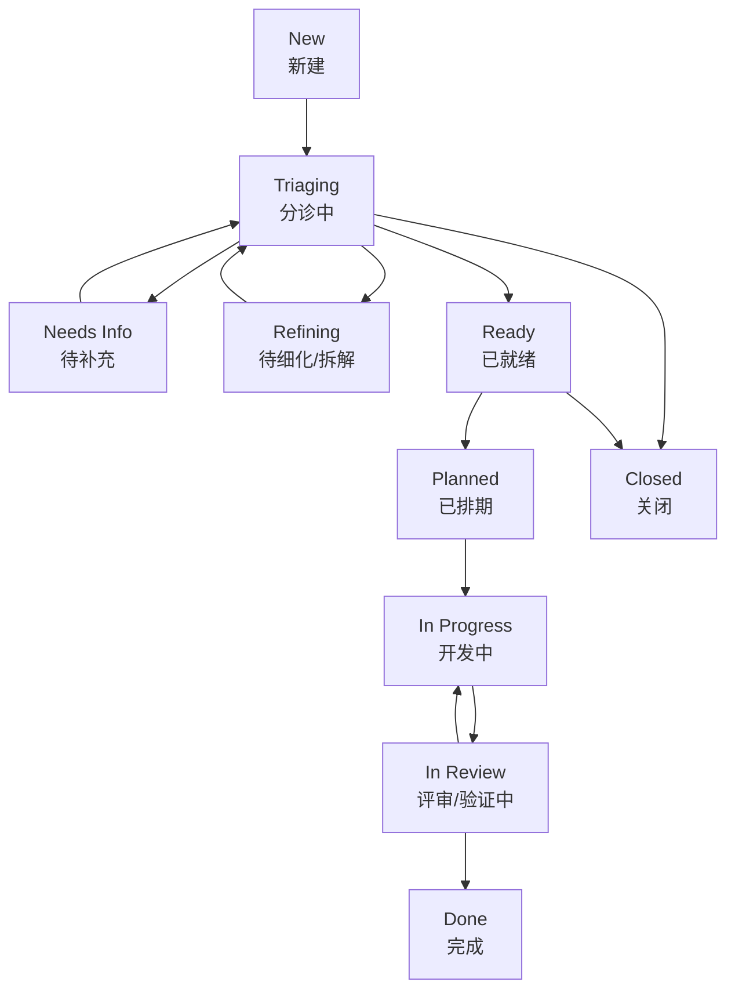

# Issue Workflow Design

## Goal

重新梳理 issue 状态流转工作流，使其同时满足两类需求：

- 人可以用统一规则做分诊、讨论、拆解、排期和推进
- 系统可以把核心阶段映射到稳定的状态机和自动化触发点

本设计采用 `主状态 + 多 tag` 解耦方式：

- `主状态` 表示 issue 当前推进阶段
- `tag` 表示 issue 的属性、风险、规模和阻塞信息

## Design Principles

1. 主状态尽量少，避免把讨论、分类、阻塞都塞进状态机。
2. tag 允许多选，不固定层数，但建议按前缀分组，便于人看和系统识别。
3. 大 issue 不直接进入开发，必须先细化为可执行子 issue。
4. 讨论、补信息、打 tag、拆分任务属于阶段动作，不单独建状态。
5. 自动化只在信息足够完整的阶段触发，避免机器人在模糊需求上推进。

## Recommended Approach

推荐使用 `状态 + tag 解耦方案`。

原因：

- 适合当前仓库已有的轻量 issue 状态机演进
- 便于后续把更多分类和管理规则放到 tag，而不是继续膨胀枚举值
- 既适合人工管理，也适合机器人基于阶段和标签做条件判断

## Main Workflow

## State Definitions

| 状态 | 含义 | 进入条件 | 退出条件 |
| --- | --- | --- | --- |
| `New` | issue 刚创建，尚未处理 | 新 issue 创建 | 被接手分诊 |
| `Triaging` | 正在判断价值、范围、归属和优先级 | 开始分诊 | 进入补信息、细化、就绪或关闭 |
| `Needs Info` | 信息不足，等待补充 | 关键背景、目标或验收标准缺失 | 信息补齐，回到分诊 |
| `Refining` | issue 过大或过于模糊，需要细化 | 被识别为大 issue 或多目标 issue | 拆解完成，回到分诊 |
| `Ready` | 信息完整，可进入排期 | 类型、优先级、范围、验收标准明确 | 被排期、关闭 |
| `Planned` | 已确认进入某次迭代或处理队列 | 已指定 owner 或处理顺序 | 开始开发 |
| `In Progress` | 开发已开始 | 代码、分支或 MR 已启动 | 进入评审或验证 |
| `In Review` | 处于评审、验收、验证阶段 | MR 已提交评审或进入验证 | 通过后完成，失败则退回开发 |
| `Done` | issue 完成并关闭闭环 | 代码、验证、结论均完成 | 一般不再退出 |
| `Closed` | 不做、重复、过期或拒绝 | 明确关闭原因 | 一般不再退出 |

## Tag Model

tag 不限制层数，但建议用前缀约定，保证可读性和自动化兼容性。

| 维度 | 示例 tag | 作用 |
| --- | --- | --- |
| 类型 | `type:feature` `type:bug` `type:task` `type:doc` | 标识 issue 性质 |
| 规模 | `size:S` `size:M` `size:L` `size:XL` | 判断是否需要拆解 |
| 优先级 | `priority:P0` `priority:P1` `priority:P2` | 排期和响应级别 |
| 归属 | `area:gateway` `area:robot` `area:ci` | 标识负责模块 |
| 风险 | `risk:high` `risk:migration` | 提醒评审和验证策略 |
| 阻塞/状态辅助 | `status:blocked` `status:needs-info` `status:needs-decision` | 表达非主流程状态 |
| 关闭原因 | `reason:duplicate` `reason:not-planned` | 关闭时保留原因 |

建议规则：

1. 每个 issue 应至少有一个 `type:*`。
2. 进入 `Ready` 前应补齐 `priority:*` 和 `area:*`。
3. `size:L` 和 `size:XL` 默认先进入 `Refining`。
4. `status:*` 是辅助标签，不替代主状态。

## Big Issue Refinement

以下情况应视为大 issue：

- `size:L` 或 `size:XL`
- 一个 issue 同时包含多个可独立交付目标
- 无法在一次 MR 中稳定完成
- 讨论很多，但范围和验收标准仍不清晰

处理规则：

1. 大 issue 进入 `Refining`，不直接进入 `Ready` 或 `In Progress`。
2. 建议拆成 `1 个 parent issue + 多个子 issue`。
3. parent issue 负责描述业务目标、整体范围、验收口径和依赖关系。
4. 子 issue 负责承载可实现、可验证、可关闭的具体任务。
5. 只有子 issue 进入 `Planned`、`In Progress`、`In Review`。
6. parent issue 在关键子 issue 完成后进入 `Done`。

## Stage Actions

| 阶段 | 人需要做的事 | 机器人可做的事 | 关键操作 |
| --- | --- | --- | --- |
| `New` | 补充背景、目标、上下文 | 检查模板完整性 | 初步打 `type:*` |
| `Triaging` | 分类、判优先级、判归属、确认是否值得做 | 提示缺失字段、提示推荐标签 | 打 `priority:*` `area:*` |
| `Needs Info` | 发起追问、记录待补充项 | 自动提醒补充信息 | 打 `status:needs-info` |
| `Refining` | 拆子 issue、补范围、补验收标准 | 生成拆解建议或 checklist | 打 `size:L/XL` |
| `Ready` | 确认讨论结论，补齐前置条件 | 生成计划草稿、建议执行路径 | 清理阻塞 tag |
| `Planned` | 指定 owner，确认进入处理队列 | 生成任务计划或开发入口 | 明确 owner 和顺序 |
| `In Progress` | 开发实现、同步进度 | 触发计划生成、实现、同步状态 | 关联 branch/MR |
| `In Review` | 做 code review、验收、验证 | 跑验证、汇总结果、回写状态 | 必要时打 `status:blocked` |
| `Done` | 关闭 issue，沉淀结论 | 回写总结、收尾通知 | 清理临时辅助 tag |
| `Closed` | 记录关闭原因 | 可回写关闭说明 | 打 `reason:*` |

## Discussion Rules

讨论是工作流的一部分，但不单独建状态。

建议规则：

1. 分诊阶段的讨论重点是澄清目标、范围、价值和归属。
2. 若讨论后仍缺少决定性信息，转 `Needs Info`，而不是继续悬空。
3. 若讨论暴露出 issue 过大或包含多个目标，转 `Refining`。
4. 若仅存在阻塞但主体方向已明确，保留当前主状态，并加 `status:blocked`。
5. 涉及关键取舍但尚未决策时，加 `status:needs-decision`，避免误入开发。

## Entry Criteria By Stage

| 目标阶段 | 最低建议前置条件 |
| --- | --- |
| `Ready` | 已有 `type:*`、`priority:*`、`area:*`，目标和验收标准明确 |
| `Planned` | 已确认 owner 或处理顺序，无关键未决问题 |
| `In Progress` | 范围稳定，可在一个实现周期内推进，大 issue 已拆解 |
| `In Review` | 代码已提交，验证方式明确 |
| `Done` | 验证通过，结果已回写到 issue 或 MR |

## Automation Guidance

机器人建议只在以下阶段参与主动推进：

- `Ready`：生成计划建议、拆解建议、执行建议
- `Planned`：进入正式开发准备
- `In Progress`：推进实现、同步状态、更新 MR
- `In Review`：执行验证、汇总检查结果

机器人不应在以下情况下主动推进开发：

- issue 仍在 `Needs Info`
- issue 仍在 `Refining`
- 缺少关键标签和验收标准
- 存在 `status:needs-decision`

## Mapping To Current State Machine

当前仓库中的 issue 状态机为：

`New -> Triaging -> NeedsInfo/Validated -> AwaitingStartCommand -> MrOpened`

建议映射如下：

| 当前状态机 | 新工作流语义 |
| --- | --- |
| `New` | `New` |
| `Triaging` | `Triaging` |
| `NeedsInfo` | `Needs Info` |
| `Validated` | `Ready` |
| `AwaitingStartCommand` | `Planned` |
| `MrOpened` | `In Progress` |

补充建议：

1. `Refining` 可以作为后续新增状态插入到 `Triaging` 和 `Ready` 之间。
2. `In Review` 和 `Done` 更适合由 MR 状态机或 issue-MR 联动补足。
3. 在实现上，先做语义映射，再逐步扩展状态机，比一次性重写更稳妥。

## Acceptance Criteria

本设计可接受的标准：

- issue 有清晰、少量、稳定的主状态
- 分类和属性主要通过多 tag 表达，而不是继续增加状态
- 大 issue 有明确的细化和拆分规则
- 每个阶段都定义了需要做的事，包括讨论、打 tag 和推进动作
- 现有仓库状态机可以低成本映射到新设计
- 机器人可以根据阶段和标签判断是否应继续执行
